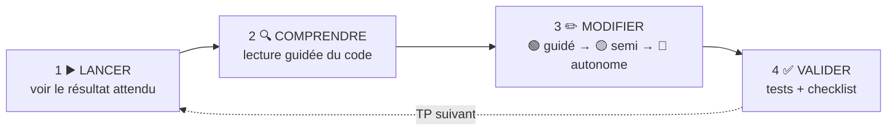
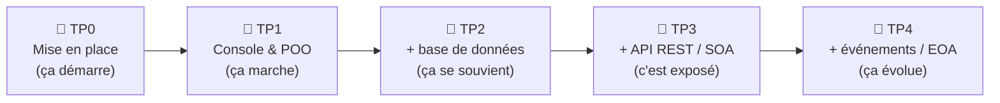

# 🎓 Parcours pédagogique PlaylistApp — Sommaire des TP

> 🎯 **Suivez votre progression** dans le [tableau de bord interactif](https://ggaillard.github.io/playlist-csharp) ou dans [PROGRESSION.md](PROGRESSION.md).
>
> Apprendre C# / .NET 10 en partant d'un exemple fonctionnel et en se l'appropriant par des modifications progressives.

---

## 🧭 La méthode : 4 étapes, répétées sur chaque TP

Vous ne codez jamais à partir d'une page blanche : vous partez d'un exemple qui marche, vous le comprenez, puis vous le faites évoluer.

| Étape | Ce que vous faites | Pourquoi |
|---|---|---|
| **1. Lancer** | Exécuter l'exemple fourni | Voir le résultat attendu avant de toucher au code |
| **2. Comprendre** | Lecture guidée du code, fichier par fichier | Savoir *où* et *pourquoi* avant de modifier |
| **3. Modifier** | 3 paliers : guidé → semi-guidé → autonome | S'approprier en faisant, avec un filet de sécurité dégressif |
| **4. Valider** | Lancer les tests, cocher la checklist | Prouver que ça marche, sans deviner |

### Les 3 paliers de modification

| Palier | Niveau | Ce qu'on vous donne |
|---|---|---|
| 🟢 **Guidé** | Débutant | Objectif + démarche détaillée + indice |
| 🟡 **Semi-guidé** | Intermédiaire | Objectif + grandes étapes + indice |
| 🔴 **Autonome** | Avancé | Objectif + vérification (à vous la démarche) |

> Les solutions complètes ne sont **pas** dans ces fiches : chercher fait partie de l'apprentissage. En cas de blocage, ouvrez une *issue* (modèle « Question » fourni).

### 🔑 Légende des icônes (les mêmes dans tout le dépôt)

| Icône | Signification |
|---|---|
| ✍️ | **À faire** : une action concrète attendue de vous |
| 🎓 | Lire la fiche concept **+ auto-évaluation** (à faire en premier) |
| 🟢 🟡 🔴 | Niveau d'une mission : guidé · semi-guidé · autonome |
| ✅ | **Valider** : faire passer les tests / cocher la checklist |
| 🐳 | Conteneuriser avec Docker |
| 💾 | Commit & push (versionner votre travail) |

---

## 🗺️ Les 4 TP — la trajectoire

| TP | Titre | Durée | Compétence | Fiche |
|---|---|---|---|---|
| **TP0** | Mise en place de l'environnement | ~30 min | — | [🚀 Ouvrir TP0](TP0_GUIDE.md) |
| **TP1** | Application console & POO | 4h | SLAM1 | [📘 Ouvrir TP1](PlaylistApp/TP1_GUIDE.md) |
| **TP2** | Persistance avec Entity Framework Core | 6h | SLAM3, SLAM2 | [📗 Ouvrir TP2](PlaylistAppEF/TP2_GUIDE.md) |
| **TP3** | API REST & architecture SOA | 4h | SLAM4 | [📕 Ouvrir TP3](PlaylistAppAPI/TP3_GUIDE.md) |
| **TP4** | Architecture événementielle (EOA) | 4h | SLAM4 | [🎏 Ouvrir TP4](PlaylistAppAPI/TP4_GUIDE.md) |

Chaque TP **réutilise** le précédent : le TP3 (API) s'appuie sur la base du TP2, le TP4 (événements) sur l'API du TP3. Vous construisez une vraie application, par couches.

---

## 📦 Productions à rendre (par TP)

Pour chaque TP, le rendu = **du code qui compile + des tests verts + des commits réguliers**. Tout vit dans votre dépôt : aucun document à envoyer par mail.

| TP | À rendre dans le dépôt | Preuve automatique (CI / autograding) |
|---|---|---|
| **📘 TP1** | Les 3 missions (note, tri, recherche par genre) committées · l'app console qui se lance | Badge **TP1 – Build** vert · image Docker construite |
| **📗 TP2** | Migration appliquée (base créée) · entité **Artiste** (relation 1-N) · les tests qui passent | Badge **TP2 – Tests** vert · **31 tests** au vert |
| **📕 TP3** | API qui démarre + Swagger accessible · endpoints GET/POST testés | Badge **TP3 – API** vert · **8 tests d'intégration** au vert |
| **🎏 TP4** | Les 3 modifications EOA (suppression, HistoriqueHandler, NoteModifieeEvent) · événements visibles dans les logs | **5 tests EOA** au vert (autograding) |
| **🏁 Global** | `PROGRESSION.md` à jour et committé · historique de commits propre (`feat:`, `fix:`…) · lien du dépôt communiqué | Le **statut vert** des workflows (onglet **Actions** de GitHub) |

> ✅ **Comment prouver un rendu ?** Poussez votre code : les **GitHub Actions** s'exécutent automatiquement et affichent un badge vert/rouge. Cochez vos missions dans `PROGRESSION.md` (ou exportez depuis le tableau de bord) et committez.

---

## 🎓 Les concepts de cours, par TP

Chaque TP s'appuie sur des **fiches concept** ([dossier `cours/`](cours/README.md)) : schéma + explication + auto-évaluation. La bonne méthode pour chaque notion : **lire la fiche → faire l'auto-évaluation → pratiquer dans le TP**.

### 🚀 TP0 — Mise en place · [▶️ ouvrir le TP](TP0_GUIDE.md)
[Environnement de développement (Dev Container)](cours/environnement.md)

### 📘 TP1 — Console & POO · [▶️ ouvrir le TP](PlaylistApp/TP1_GUIDE.md)
[POO (classes, encapsulation)](cours/poo.md) · [Collections (`List` / `Dictionary`)](cours/collections.md) · [Requêtes LINQ](cours/linq.md)

### 📗 TP2 — Entity Framework Core · [▶️ ouvrir le TP](PlaylistAppEF/TP2_GUIDE.md)
[ORM & `DbContext`](cours/orm.md) · [Migrations](cours/migrations.md) · [Relations 1-N / N-N](cours/relations.md)

### 📕 TP3 — API REST & SOA · [▶️ ouvrir le TP](PlaylistAppAPI/TP3_GUIDE.md)
[HTTP, REST & codes de statut](cours/rest-http.md) · [Architecture SOA en couches](cours/soa.md)

### 🎏 TP4 — Architecture événementielle · [▶️ ouvrir le TP](PlaylistAppAPI/TP4_GUIDE.md)
[Événements & publish/subscribe (EOA)](cours/eoa.md)

> 🧮 Un **quiz interactif** couvrant tous ces concepts est aussi dans le [tableau de bord](https://ggaillard.github.io/playlist-csharp) (onglet « Quiz ») et compte dans votre progression.

## 🚦 Avant de commencer

> 🚀 **Étape 0 — faites le [TP0 : mettre en place l'environnement](TP0_GUIDE.md)** : l'application doit tourner (Codespaces ou VS Code local) **avant** de démarrer les TP.

1. **Mise en route** (créer le dépôt, ouvrir Codespaces) : suivez le **[Guide étudiant](GUIDE_ETUDIANT.md)** — c'est la procédure de référence.
2. Suivez ensuite les fiches **dans l'ordre** : TP1 → TP2 → TP3 → TP4.
3. Cochez votre progression dans `PROGRESSION.md` et committez régulièrement.

> 📚 **Pour aller plus loin :** méthode, prérequis et stack à jour dans le [Guide d'apprentissage](APPRENTISSAGE.md).

---

## 🏆 Ce que vous saurez faire à la fin

- Lire et faire évoluer un code C# existant (la réalité du métier)
- Concevoir et interroger une base de données avec un ORM
- Construire et documenter une API REST
- Distinguer et appliquer les architectures SOA et EOA
- Valider votre travail par des tests automatiques
- Travailler en mode projet avec Git, Docker et l'intégration continue
