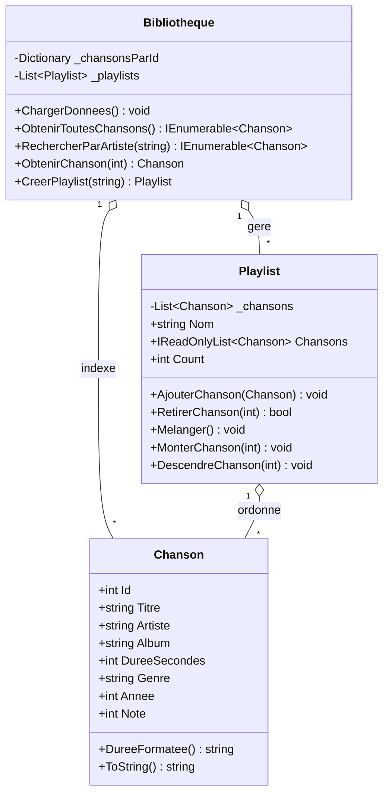

# 🎵 PlaylistApp – Cas pratique C# & Docker


---

## 📌 Objectif pédagogique

Ce projet illustre les concepts fondamentaux du développement C# **dans un conteneur Docker** :

| Concept | Mise en œuvre |
|---|---|
| Programmation orientée objet | Classes `Chanson`, `Playlist`, `Bibliotheque` |
| Encapsulation | `IReadOnlyList<Chanson>` en accès lecture seule |
| Collections génériques | `List<T>`, `Dictionary<K,V>` |
| Requêtes LINQ | `.Where()`, `.OrderBy()`, `.GroupBy()`, `.Sum()` |
| Patron Dépôt (Repository) | `Bibliotheque` comme couche service |
| Gestion des exceptions | `try/catch`, exceptions métier personnalisées |
| Conteneurisation | `Dockerfile` multi-étapes, image légère |

---

## 🗂 Structure du projet

```
PlaylistApp/
├── Dockerfile              ← Image Docker multi-étapes
├── .dockerignore           ← Fichiers exclus du contexte Docker
├── PlaylistApp.csproj      ← Configuration du projet .NET 10
├── Program.cs              ← Point d'entrée + menu interactif
├── Modeles/
│   ├── Chanson.cs          ← Entité chanson
│   └── Playlist.cs         ← Entité playlist (collection de chansons)
└── Services/
    └── BibliothequeMusicale.cs  ← Service : bibliothèque + playlists
```

---


## 🧩 Documentation technique — Diagramme de classes

Structure objet de l'application (modèle du domaine + service) :



> `Bibliotheque` indexe les chansons (`Dictionary`) et gère les playlists ; chaque `Playlist` ordonne ses `Chanson`.

## 🚀 Démarrage rapide

### Sans Docker (si .NET 10 SDK installé localement)
```bash
cd PlaylistApp
dotnet run
```

### Avec Docker (recommandé en TP)
```bash
# 1. Builder l'image
docker build -t playlist-app .

# 2. Lancer en mode interactif
docker run -it playlist-app

# 3. (optionnel) Nommer le conteneur
docker run -it --name mon-player playlist-app
```

### Commandes Docker utiles
```bash
# Lister les images
docker images

# Lister les conteneurs actifs
docker ps

# Supprimer l'image
docker rmi playlist-app

# Inspecter l'image
docker inspect playlist-app
```

---

## 📐 Diagramme de classes (simplifié)

```
┌─────────────────┐          ┌──────────────────────────┐
│    Chanson      │          │        Playlist           │
├─────────────────┤    1..*  ├──────────────────────────┤
│ Id: int         │◄─────────│ Id: int                  │
│ Titre: string   │          │ Nom: string               │
│ Artiste: string │          │ Description: string       │
│ Album: string   │          │ CreeLe: DateTime          │
│ Duree: int      │          │ Chansons: IReadOnlyList   │
│ Genre: string   │          ├──────────────────────────┤
│ Annee: int      │          │ AjouterChanson()          │
├─────────────────┤          │ RetirerChanson()          │
│ DureeFormatee() │          │ Melanger()                │
│ ToString()      │          │ RechercherParArtiste()    │
└─────────────────┘          └──────────────────────────┘
                                         △
                                         │ gère
                             ┌──────────────────────────┐
                             │   BibliothequeMusicale    │
                             ├──────────────────────────┤
                             │ _chansons: Dict<int,Ch>   │
                             │ _playlists: Dict<int,Pl>  │
                             ├──────────────────────────┤
                             │ AjouterChanson()          │
                             │ RechercherChansons()      │
                             │ CreerPlaylist()           │
                             │ AjouterChansonPlaylist()  │
                             │ AfficherStatistiques()    │
                             └──────────────────────────┘
```

---

## 📝 Exercices proposés

### Niveau 1 – Découverte
1. Ajouter 3 chansons de votre choix à la bibliothèque
2. Créer une playlist personnelle et y ajouter 5 chansons
3. Tester la fonctionnalité de recherche

### Niveau 2 – Évolution du code
1. Ajouter une propriété `Note` (note de 1 à 5) à `Chanson`
2. Implémenter `ObtenirMeilleuresChansons(int n)` dans `BibliothequeMusicale`
3. Ajouter l'option "Trier la playlist par durée / artiste / note"

### Niveau 3 – Persistance (bonus → voir TP2)
1. Sérialiser la bibliothèque en **JSON** avec `System.Text.Json`
2. Charger/sauvegarder dans un fichier `bibliotheque.json`
3. Monter un **volume Docker** pour persister les données :
   ```bash
   docker run -it -v $(pwd)/donnees:/app/donnees playlist-app
   ```

---

## ➡️ Suite : TP2 – Entity Framework Core & SQLite

Le **TP2** introduit la persistance des données avec **Entity Framework Core** et une base **SQLite** conteneurisée.
→ Voir le dossier `PlaylistAppEF/`

---

## 📦 Technologies utilisées

| Technologie | Version | Rôle |
|---|---|---|
| C# | 12 | Langage de développement |
| .NET | 8 LTS | Environnement d'exécution |
| Docker | 24+ | Conteneurisation |
| Image de base | `mcr.microsoft.com/dotnet/runtime:8.0` | Image légère |
| Construction | Multi-étapes (SDK → Runtime) | Optimisation de l'image |

---

## 🔗 Ressources

- [Documentation C# – Microsoft](https://learn.microsoft.com/fr-fr/dotnet/csharp/)
- [Guide Docker pour .NET](https://learn.microsoft.com/fr-fr/dotnet/core/docker/introduction)
- [LINQ en C#](https://learn.microsoft.com/fr-fr/dotnet/csharp/linq/)
