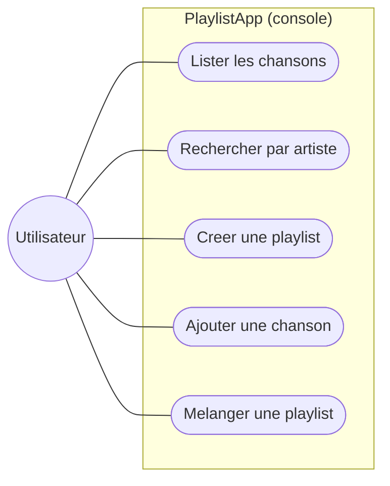
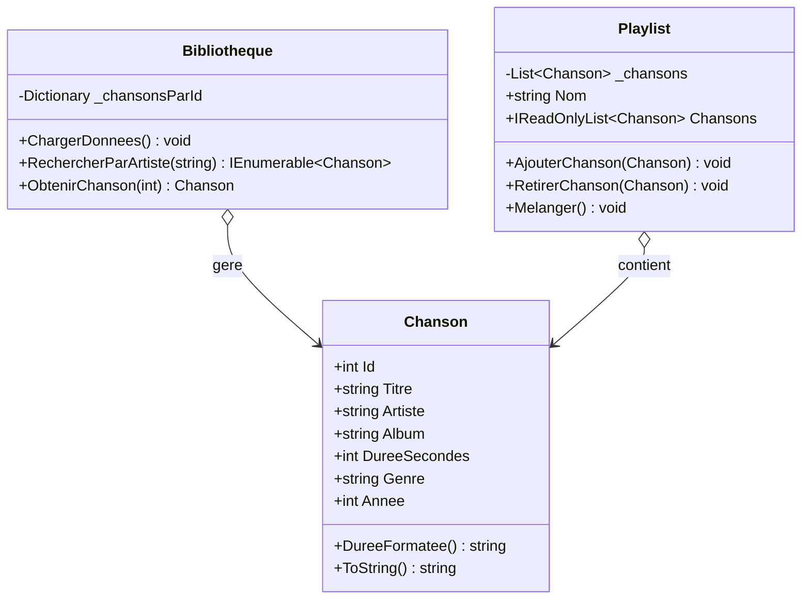
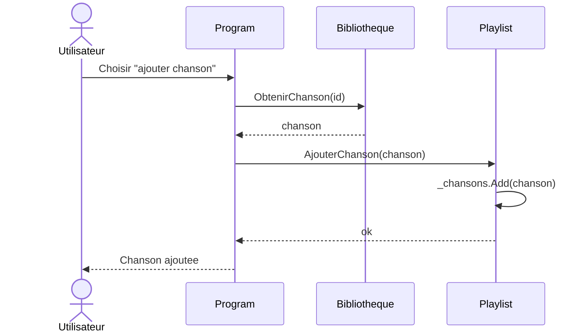
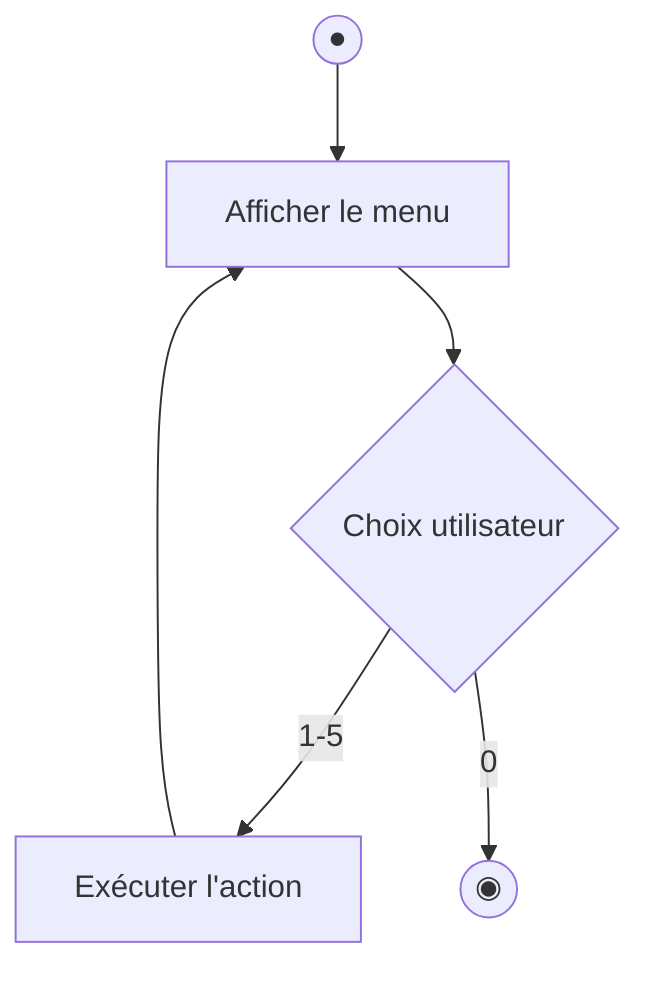
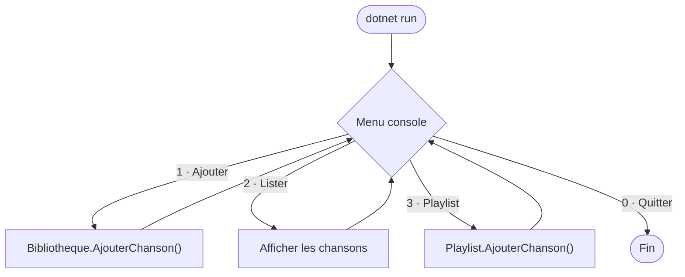

# 📘 TP1 — Application console & Programmation Orientée Objet

> **Module :** PlaylistApp (1/4) · **Durée : 4h**

> 🎓 **Concepts associés — à lire EN PREMIER** (explication + auto-évaluation) : [POO](../cours/poo.md) · [Collections](../cours/collections.md) · [LINQ](../cours/linq.md)
>
> 👉 **Étape 1 du TP — avant de coder :** lisez ces fiches et réussissez leur **auto-évaluation**. (Le comparatif et le choix de chaque notion y sont aussi détaillés.)

> **Démarche :** partir d'un exemple fonctionnel → le comprendre → se l'approprier par des modifications.

---

> 🏛️ **Enjeu d'architecture** — Ce TP pose les **fondations objet** (encapsulation, choix des structures de données). Bien les poser conditionne la lisibilité et l'évolutivité de toute la suite. Arbitrage récurrent : **structurer proprement** vs **aller au plus vite**.

## 1. Objectifs pédagogiques

À la fin de ce TP, vous serez capable de :

| # | Compétence visée | Comment vous la prouverez |
|---|---|---|
| O1 | Lire et comprendre une classe C# (POO) | Vous expliquerez le rôle de chaque classe |
| O2 | Manipuler des collections (`List<T>`, `Dictionary<K,V>`) | Vous ajouterez une méthode de tri |
| O3 | Écrire une requête LINQ | Vous créerez une nouvelle recherche |
| O4 | Faire évoluer un code existant sans le casser | Vos modifications compileront et tourneront |
| O5 | Conteneuriser avec Docker | Vous lancerez l'app dans un conteneur |

**Compétence BTS :** SLAM1 (concevoir et développer une solution applicative).
**Prérequis :** notions de base de programmation. Aucune installation locale (tout se fait dans GitHub Codespaces).

---

## 2. Contexte métier

> Une médiathèque municipale veut un premier outil interne pour gérer ses playlists musicales : lister des morceaux, les ranger dans des playlists, faire des recherches. On commence par une **application console** simple, en mémoire. Les TP suivants ajouteront une base de données (TP2) puis une API web (TP3).

Vous ne partez **pas d'une page blanche** : un exemple fonctionnel vous est fourni. Votre travail est de le **comprendre** puis de l'**enrichir**.

---

## 3. Modélisation UML

> Avant de plonger dans le code, voici les 4 vues UML qui décrivent ce TP. Sur GitHub, ces diagrammes s'affichent automatiquement.

### Diagramme de cas d'utilisation
Ce que l'utilisateur peut faire avec l'application console.



> 🗺️ **Lire le diagramme de cas d'usage** : le **rond** est l'acteur (l'utilisateur, ou l'émetteur d'un événement) ; chaque **bulle** est une action / un cas d'usage ; les **traits** relient l'acteur aux actions qu'il peut déclencher.

### Diagramme de classes
La structure du code : trois classes et leurs relations.



> 🗺️ **Lire le diagramme de classes** : chaque boîte est une **classe** (ses attributs en haut, ses méthodes en bas). Le préfixe `+` = **public** (visible de l'extérieur), `-` = **privé** (interne). Les liens montrent les **relations** : `o--` composition (« contient/possède »), `-->` association/dépendance, `<|--` héritage.

### Diagramme de séquence — « ajouter une chanson à une playlist »
L'enchaînement des appels entre objets pour cette action.



> 🗺️ **Lire le diagramme de séquence** : chaque **colonne** est un participant (objet ou service) ; le **temps s'écoule de haut en bas**. Une flèche pleine `->>` = un **appel**, une flèche pointillée `-->>` = une **réponse/retour**. Un bloc `par` regroupe des actions exécutées **en parallèle**.

### Diagramme d'activité — la boucle du menu
Le flux de contrôle de l'application.



> 🗺️ **Lire le diagramme d'activité (UML)** : **●** = nœud initial (début) · **◉** = nœud final (fin) ; un **rectangle** = une action, un **losange** = une décision (chaque branche = une réponse), un **cylindre** = une base de données.

---

## 4. Lancer l'application

> 🚀 **L'environnement est déjà en place** depuis le **[TP0 — Mise en place](../TP0_GUIDE.md)** (Codespaces ou VS Code local). Si ce n'est pas fait, faites-le d'abord.

Dans le terminal :

```bash
cd PlaylistApp
dotnet run
```

✅ **Résultat attendu :** le menu de l'application s'affiche. Testez-le : `1` liste les chansons, `2` recherche, `0` quitte. **L'exemple fonctionne — vous pouvez maintenant l'étudier.**

---

## 5. Comprendre l'exemple fourni

> 🔁 **Vue d'ensemble de l'exécution** — la boucle de menu de `Program.cs` orchestre `Bibliotheque` et `Playlist` :



> 🗺️ **Lire l'organigramme** : on suit le **sens des flèches** ; l'**étiquette** sur une flèche précise la condition ou l'action. Un **rectangle** = une étape/action, un **losange** = une décision (chaque branche = une réponse possible), un **cylindre** = une base de données (lorsqu'ils sont présents).


> Avant de modifier, on lit. Voici l'architecture et le rôle de chaque fichier.

```
PlaylistApp/
├── Models/
│   ├── Chanson.cs          ← Une chanson (titre, artiste, durée…)
│   └── Playlist.cs      ← Une playlist = une liste ordonnée de chansons
├── Services/
│   └── Bibliotheque.cs  ← Le "cerveau" : gère toutes les chansons et playlists
└── Program.cs           ← Le menu et l'interaction avec l'utilisateur
```

### Lecture guidée — dans cet ordre

**1. `Models/Chanson.cs`** — la brique de base.
Ouvrez le fichier. Repérez :
- Les **propriétés** (`Title`, `Artist`, `Duration`…) : ce sont les données d'une chanson.
- La **méthode** `DureeFormatee()` : transforme 354 secondes en `05:54`.
- `ToString()` : définit comment une chanson s'affiche en texte.

> 🧠 **Question de compréhension :** pourquoi `Duration` est un `int` (secondes) et pas une chaîne « 5:54 » ? *(Réponse : pour pouvoir faire des calculs — additionner des durées, trier.)*

**2. `Models/Playlist.cs`** — un conteneur de chansons.
Repérez :
- Le champ privé `_chansons` de type `List<Chanson>` : la collection ordonnée.
- La propriété `Songs` en `IReadOnlyList` : on peut **lire** la liste de l'extérieur, mais pas la modifier directement (c'est l'**encapsulation**).
- Les méthodes `AjouterChanson`, `RetirerChanson`, `Shuffle`.

**3. `Services/Bibliotheque.cs`** — le service central.
Repérez :
- `Dictionary<int, Chanson>` : range les chansons par identifiant pour un accès rapide.
- La méthode `SeedData()` : crée les données de démonstration au démarrage.
- Les méthodes de recherche utilisant **LINQ** (`.Where()`, `.OrderBy()`).

**4. `Program.cs`** — le point d'entrée.
C'est la boucle du menu qui appelle les méthodes ci-dessus.

> 📌 **Schéma mental à retenir :**
> `Program.cs` (interface) → `Bibliotheque` (logique) → `Chanson` / `Playlist` (données)

---

## 6. ✍️ S'approprier le code par la modification

> **C'est le cœur du TP.** Vous allez faire évoluer l'exemple en 3 paliers. Chaque modification suit le même rituel : **Objectif → Démarche → Vérification → Indice**. La solution complète n'est pas donnée : à vous de chercher (c'est ça, s'approprier).

### ✍️ 🟢 Modification 1 (guidée) — Ajouter une note aux chansons

**🎯 Objectif :** chaque chanson pourra avoir une note de 1 à 5 étoiles.

**📝 Démarche :**
1. Dans `Models/Chanson.cs`, ajoutez une propriété `Note` de type `int`.
2. Donnez-lui une valeur par défaut de `3`.
3. Modifiez `ToString()` pour afficher la note (ex. `★3`).

**🔍 Vérification :** relancez `dotnet run`, listez les chansons → la note apparaît.

**💡 Indice :** une propriété s'écrit `public int Note { get; set; } = 3;`. Pour l'affichage, ajoutez `★{Note}` dans la chaîne du `ToString()`.

---

### ✍️ 🟡 Modification 2 (semi-guidée) — Trier une playlist par durée

**🎯 Objectif :** ajouter une option « trier la playlist par durée » dans le menu.

**📝 Démarche :**
1. Dans `Models/Playlist.cs`, ajoutez une méthode `TrierParDuree()` qui réordonne `_chansons`.
2. Dans `Program.cs`, ajoutez une entrée de menu qui appelle cette méthode.

**🔍 Vérification :** créez une playlist, ajoutez-y des chansons de durées différentes, triez → l'ordre change du plus court au plus long.

**💡 Indice :** la classe `List<T>` a une méthode `.Sort(...)`. Comparez deux durées avec `a.DureeSecondes.CompareTo(b.DureeSecondes)`.

---

### ✍️ 🔴 Modification 3 (autonome) — Recherche par genre musical

**🎯 Objectif :** permettre de chercher toutes les chansons d'un genre donné (Rock, Pop…).

**📝 Démarche (à vous de la définir) :** inspirez-vous de la recherche par artiste qui existe déjà dans `Bibliotheque.cs`.

**🔍 Vérification :** chercher « Rock » renvoie uniquement les chansons de genre Rock.

**💡 Indice :** LINQ `.Where(s => s.Genre == genre)`. Pensez à ajouter l'entrée de menu correspondante.

---

## 7. 🐳 Conteneuriser avec Docker

> ℹ️ **À distinguer du TP0** : le `.devcontainer` (TP0) conteneurise votre **environnement de dev** ; **ici, on conteneurise l'application** (le livrable) pour l'exécuter / la déployer. C'est la compétence « mettre à disposition un service » (B1.5 / SPR5).

**🎯 Objectif :** faire tourner votre application dans un conteneur, comme en entreprise.

```bash
# Depuis le dossier PlaylistApp
docker build -t playlist-app .
docker run -it playlist-app
```
✅ **Résultat attendu :** le même menu s'affiche, mais cette fois l'app tourne **dans un conteneur isolé**.

> 🧠 **Question :** ouvrez le `Dockerfile`. Pourquoi y a-t-il deux étapes (`build` puis `runtime`) ? *(Réponse : l'image finale ne contient que ce qui est nécessaire pour exécuter, pas tout le SDK de compilation → image plus légère.)*

---

## 8. ✅ Validation finale — checklist

Cochez dans votre README au fur et à mesure :
- [ ] 🎓 J'ai coché mes missions dans `PROGRESSION.md` et committé
- [ ] L'application démarre (`dotnet run`)
- [ ] **Modification 1** : la note s'affiche sur les chansons
- [ ] **Modification 2** : le tri par durée fonctionne
- [ ] **Modification 3** : la recherche par genre fonctionne
- [ ] `docker build` réussit et l'app tourne dans le conteneur
- [ ] J'ai fait **au moins 3 commits** avec des messages clairs

> Sauvegardez votre travail régulièrement :
> ```bash
> git add .
> git commit -m "feat: ajout de la note sur les chansons"
> git push
> ```

---

## 9. Pour aller plus loin (optionnel)

- Ajoutez une méthode `ObtenirMeilleuresChansons(int n)` qui renvoie les `n` chansons les mieux notées.
- Affichez la durée totale d'une playlist en heures/minutes.
- Empêchez d'ajouter deux fois la même chanson à une playlist.

---

## 10. Dépannage

| Problème | Solution |
|---|---|
| `dotnet : command not found` | Reconstruisez le Codespace : `Ctrl+Shift+P` → *Rebuild Container* |
| Le menu ne réagit pas | Vérifiez que vous tapez le numéro **puis** `Entrée` |
| `docker : permission denied` | Attendez 30s après l'ouverture du Codespace puis réessayez |
| Mes modifications ne s'affichent pas | Avez-vous **enregistré** (`Ctrl+S`) puis relancé `dotnet run` ? |

---

⬅️ **TP précédent :** [TP0 — Mise en place](../TP0_GUIDE.md)
➡️ **TP suivant :** [TP2 — Entity Framework Core & base de données](../PlaylistAppEF/TP2_GUIDE.md)

🧭 **[Retour au parcours](../PARCOURS_TP.md)**
