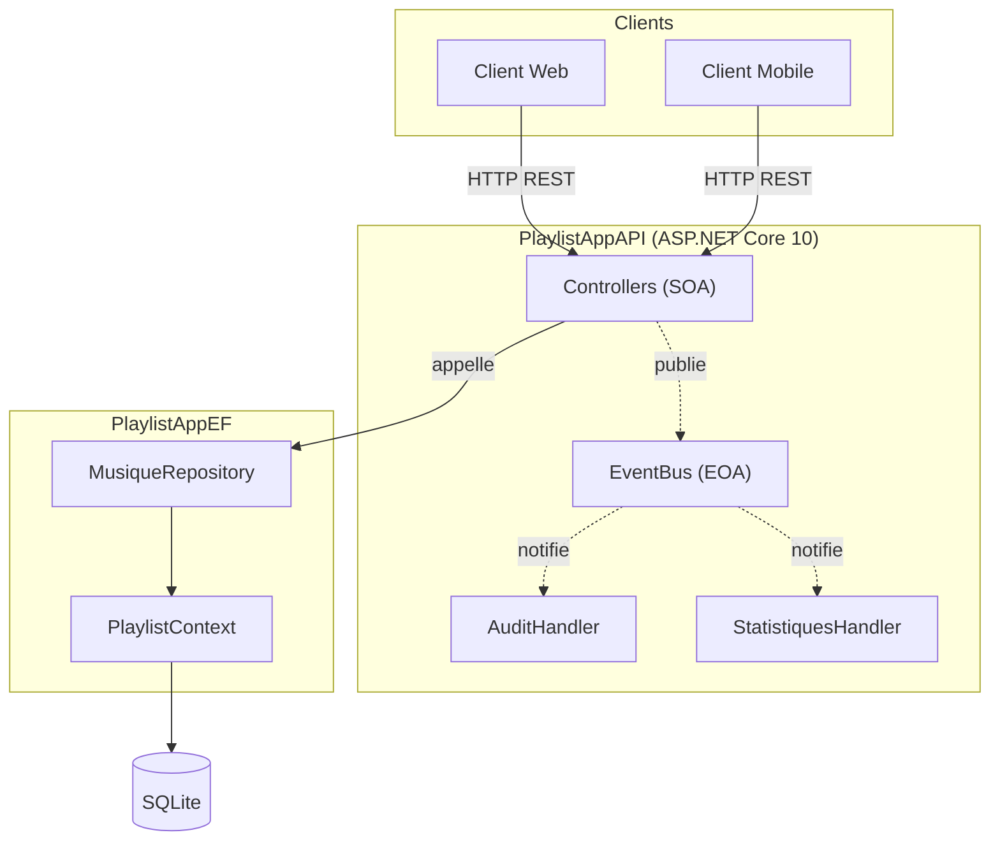
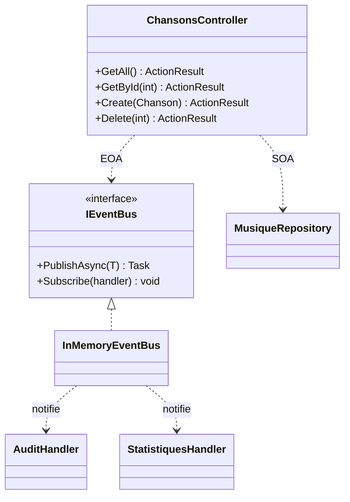
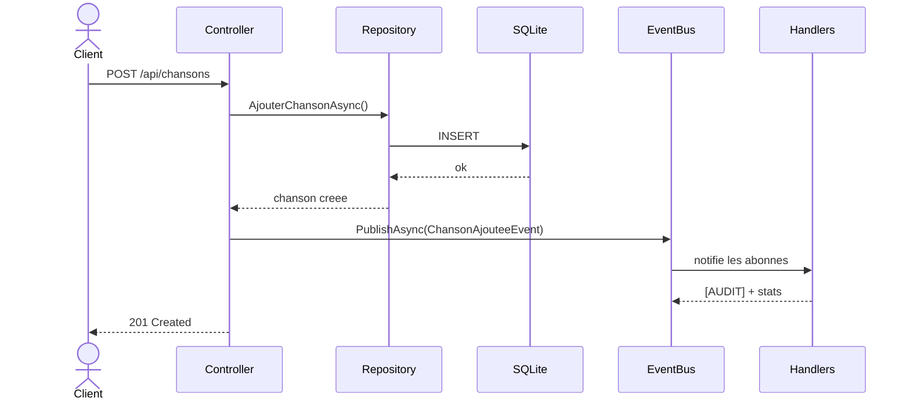

# 🎵 PlaylistAppAPI — API REST (SOA + EOA)

Service web ASP.NET Core 10 exposant la bibliothèque musicale via une API REST.
Support des deux TP : **TP3** (API REST & architecture SOA) et **TP4** (architecture événementielle EOA).

- 📕 Fiche pédagogique TP3 : [TP3_GUIDE.md](TP3_GUIDE.md)
- 🎏 Fiche pédagogique TP4 : [TP4_GUIDE.md](TP4_GUIDE.md)

---

## 🗂 Structure du projet

```
PlaylistAppAPI/
├── Controllers/
│   └── ChansonsController.cs   Endpoints REST (couche SOA)
├── Events/
│   └── EventBus.cs             Bus d'événements + handlers (couche EOA)
├── Program.cs                  Configuration (DI, Swagger, base, abonnements)
└── Dockerfile
```

Ce projet **réutilise** `PlaylistAppEF` (modèles, `PlaylistContext`, `MusiqueRepository`).

---

## 🚀 Démarrage rapide

```bash
cd PlaylistAppAPI
dotnet run
# → Swagger : http://localhost:5000
```

Avec Docker :

```bash
docker compose up --build
```

---

## 🧩 Documentation technique — Diagrammes

### Architecture en composants

Vue d'ensemble : les clients passent par les contrôleurs (SOA), qui délèguent à la couche données et publient des événements (EOA) consommés par des handlers découplés.



### Diagramme de classes



### Diagramme de séquence — POST /api/chansons (SOA puis EOA)

La persistance se fait en SOA (synchrone) ; la publication d'événement déclenche les handlers sans bloquer la réponse HTTP.



---

## 🔌 Endpoints principaux

| Verbe | Route | Description | Statut succès |
|---|---|---|---|
| GET | `/api/chansons` | Liste des chansons | 200 |
| GET | `/api/chansons/{id}` | Une chanson | 200 / 404 |
| POST | `/api/chansons` | Créer une chanson | 201 |
| PUT | `/api/chansons/{id}` | Modifier | 204 / 404 |
| DELETE | `/api/chansons/{id}` | Supprimer | 204 / 404 |
| GET | `/api/chansons/recherche?q=` | Rechercher | 200 |

---

## 🧪 Tests

```bash
dotnet test ../PlaylistAppAPI.Tests/
# 8 tests d'intégration (WebApplicationFactory)
```

---

## 🧱 Architectures illustrées

| Architecture | Où | Caractéristique |
|---|---|---|
| **SOA** | Controller → Repository → BD | synchrone, couplage faible entre couches |
| **EOA** | Controller → EventBus → Handlers | asynchrone, découplage total émetteur/abonnés |
