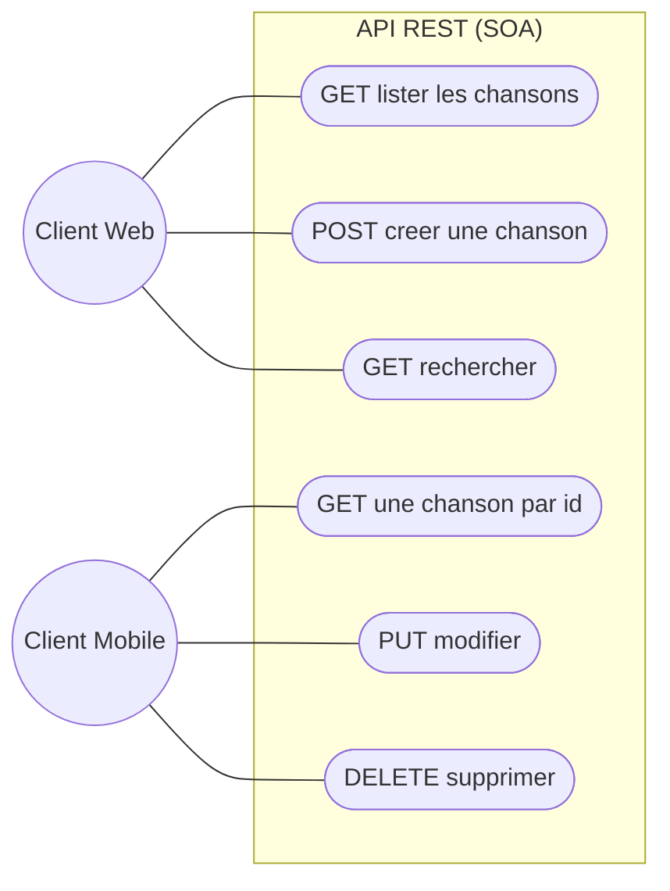
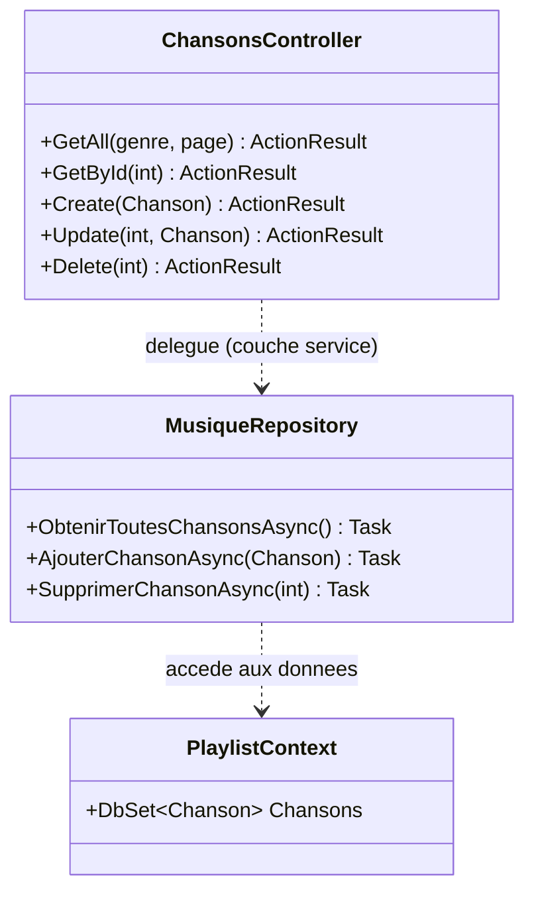
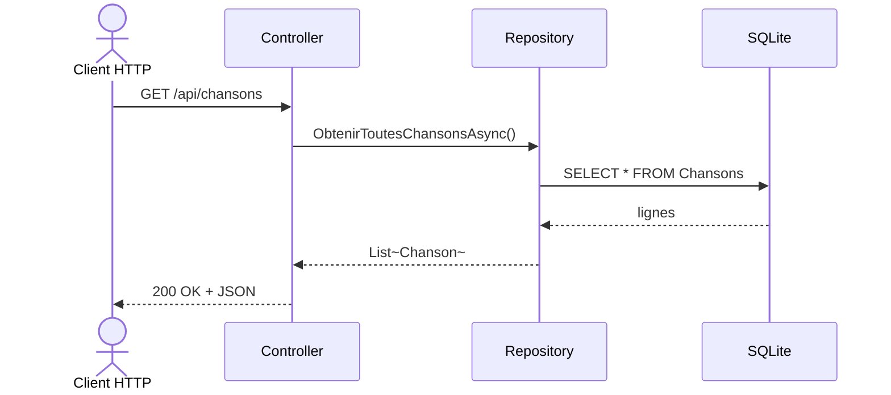
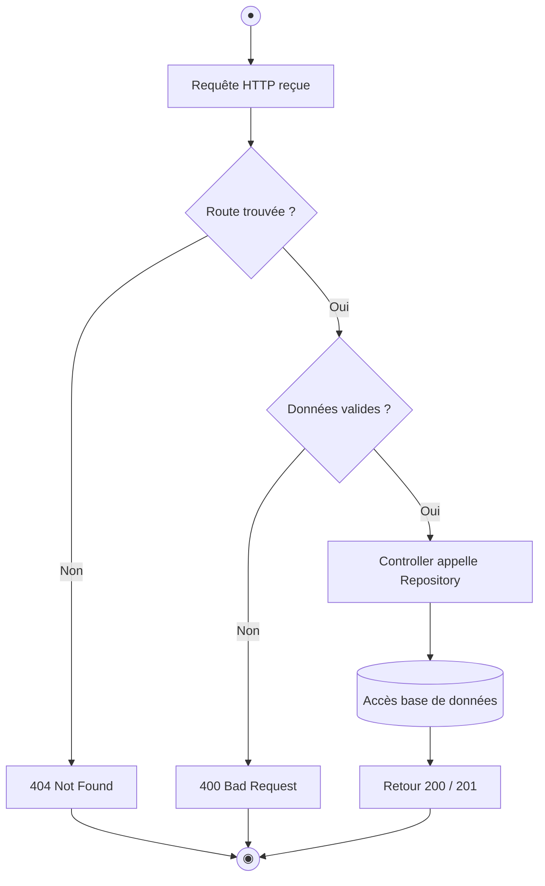
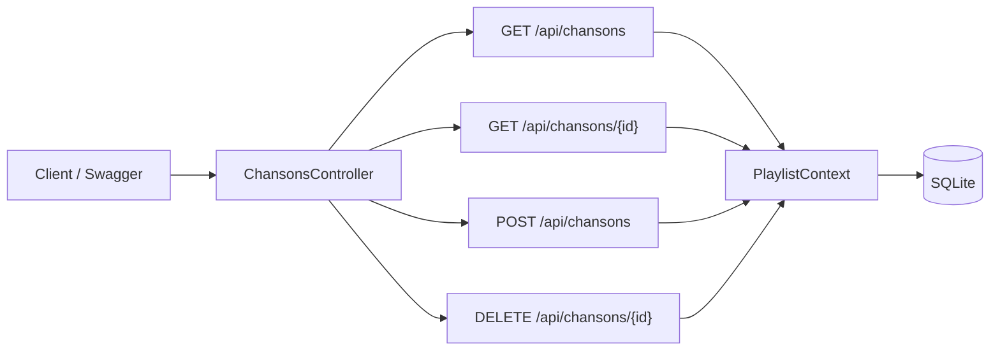

# 📕 TP3 — Construire une API REST (architecture SOA)

> **Module :** PlaylistApp (3/4) · **Durée : 4h** · Stack : .NET 10 · C# 14 · ASP.NET Core 10

> 🎓 **Concepts associés — à lire EN PREMIER** (explication + auto-évaluation) : [REST & HTTP](../cours/rest-http.md) · [Architecture SOA](../cours/soa.md)
>
> 👉 **Étape 1 du TP — avant de coder :** lisez ces fiches et réussissez leur **auto-évaluation**. (Le comparatif et le choix de chaque notion y sont aussi détaillés.)

> **Démarche :** partir d'une API fonctionnelle → comprendre REST et l'architecture en couches → l'étendre.

---

> 🏛️ **Enjeu d'architecture** — **Exposer** l'application comme un service : style **REST** (interopérable, sans état) et **découpage en couches (SOA)** pour isoler web / métier / données. Arbitrage : séparation des responsabilités vs simplicité.

## 1. Objectifs pédagogiques

À la fin de ce TP, vous serez capable de :

| # | Compétence visée | Niveau (Bloom) | Preuve |
|---|---|---|---|
| O1 | Expliquer ce qu'est une API REST | Comprendre | Vous décrivez une ressource et un verbe |
| O2 | Associer verbe HTTP et action | Appliquer | Vous choisissez GET/POST/PUT/DELETE à bon escient |
| O3 | Lire et renvoyer le bon code de statut | Appliquer | 200, 201, 404, 400 utilisés correctement |
| O4 | Expliquer l'architecture SOA en couches | Analyser | Vous tracez le chemin Controller → Repository → BD |
| O5 | Ajouter un endpoint à une API existante | Créer | Votre endpoint fonctionne dans Swagger |

**Compétence BTS :** SLAM4 (déployer un service web).
**Prérequis :** avoir terminé TP1 et TP2.

---

## 2. La théorie, pas à pas

> Cette section construit les notions **progressivement**. Lisez-la avant de coder : chaque idée prépare la suivante.

### 2.1 Le problème de départ

Au TP2, notre application tournait sur **une seule machine** (la console). Mais dans la vraie vie, une médiathèque a un **site web**, peut-être une **application mobile**, et demain d'autres outils. Tous ont besoin des **mêmes données** de chansons.

> ❓ **Question :** comment partager les mêmes données entre plusieurs programmes différents, éventuellement sur des machines différentes ?

**Réponse :** on expose les données via un **service web** que tous peuvent appeler par le réseau. C'est le rôle d'une **API**.

### 2.2 Qu'est-ce qu'une API ?

**API** = *Application Programming Interface*. C'est un **point d'entrée** par lequel un programme demande quelque chose à un autre.

> 🍽️ **Analogie du restaurant :** vous (le client) ne rentrez pas en cuisine. Vous passez par le **serveur** (l'API) : vous commandez (requête), il transmet, et vous rapporte le plat (réponse). Vous n'avez pas besoin de savoir *comment* la cuisine fonctionne.

### 2.3 HTTP : le langage du web

Sur le web, programmes et serveurs se parlent en **HTTP**. Une communication HTTP, c'est toujours une **requête** (méthode + URL + données) suivie d'une **réponse** (code de statut + données).

### 2.4 REST : organiser l'API autour de ressources

**REST** est un **style** d'API très répandu. Son idée centrale : tout est une **ressource** identifiée par une **URL**, que l'on manipule avec les **verbes HTTP**.

Dans notre cas, la ressource est « chanson ». L'URL de base est `/api/chansons`.

| Je veux… | Verbe HTTP | URL | Code de succès |
|---|---|---|---|
| Lister les chansons | `GET` | `/api/chansons` | 200 OK |
| Voir la chanson n°5 | `GET` | `/api/chansons/5` | 200 OK |
| Créer une chanson | `POST` | `/api/chansons` | 201 Created |
| Modifier la n°5 | `PUT` | `/api/chansons/5` | 204 No Content |
| Supprimer la n°5 | `DELETE` | `/api/chansons/5` | 204 No Content |

> 🧠 **À retenir :** l'URL dit *quoi* (la ressource), le verbe dit *quelle action*. C'est tout REST.

### 2.5 Les codes de statut : la réponse en un nombre

| Famille | Signification | Exemples |
|---|---|---|
| **2xx** | Succès | 200 OK · 201 Created · 204 No Content |
| **4xx** | Erreur du client | 400 mauvaise requête · 404 introuvable · 409 conflit |
| **5xx** | Erreur du serveur | 500 erreur interne |

> 🧠 **Règle simple :** 2xx « c'est bon », 4xx « tu t'es trompé », 5xx « je me suis trompé ».

### 2.6 L'architecture SOA : séparer en couches

Notre API ne mélange pas tout. Elle est **organisée en couches** ayant chacune **une seule responsabilité** — l'architecture **SOA** (*Service-Oriented Architecture*).

```
   Client HTTP
        │
        ▼
   ┌─────────────┐   « Je reçois la requête web, je renvoie la réponse »
   │ Controller  │   (ne sait RIEN de la base de données)
   └─────────────┘
        │
        ▼
   ┌─────────────┐   « Je sais lire/écrire les données »
   │ Repository  │   (ne sait RIEN du web)
   └─────────────┘
        │
        ▼
   ┌─────────────┐
   │   SQLite    │
   └─────────────┘
```

> 🧠 **Pourquoi séparer ?** Si demain on change de base de données, seul le Repository change ; le Controller ne bouge pas. C'est le **couplage faible**.

### 2.7 L'injection de dépendances (rapide)

Le Controller a besoin de l'accès aux données, mais il ne le **crée pas lui-même** : ASP.NET Core le lui **fournit**. C'est l'**injection de dépendances**, écrite en C# 14 avec un **constructeur primaire** :

```csharp
// Le Controller "reçoit" le contexte de données ; il ne le construit pas
public class ChansonsController(PlaylistContext ctx) : ControllerBase
```

> Vous approfondirez ce mécanisme au TP4 avec le bus d'événements.

---

## 3. Modélisation UML

### Diagramme de cas d'utilisation


> 🗺️ **Lire le diagramme de cas d'usage** : le **rond** est l'acteur (l'utilisateur, ou l'émetteur d'un événement) ; chaque **bulle** est une action / un cas d'usage ; les **traits** relient l'acteur aux actions qu'il peut déclencher.

### Diagramme de classes — les couches SOA


> 🗺️ **Lire le diagramme de classes** : chaque boîte est une **classe** (ses attributs en haut, ses méthodes en bas). Le préfixe `+` = **public** (visible de l'extérieur), `-` = **privé** (interne). Les liens montrent les **relations** : `o--` composition (« contient/possède »), `-->` association/dépendance, `<|--` héritage.

### Diagramme de séquence — « GET /api/chansons »


> 🗺️ **Lire le diagramme de séquence** : chaque **colonne** est un participant (objet ou service) ; le **temps s'écoule de haut en bas**. Une flèche pleine `->>` = un **appel**, une flèche pointillée `-->>` = une **réponse/retour**. Un bloc `par` regroupe des actions exécutées **en parallèle**.

### Diagramme d'activité — cycle de vie d'une requête


> 🗺️ **Lire le diagramme d'activité (UML)** : **●** = nœud initial (début) · **◉** = nœud final (fin) ; un **rectangle** = une action, un **losange** = une décision (chaque branche = une réponse), un **cylindre** = une base de données.

---

## 4. Mise en place — pas à pas

> Même dépôt, même Codespace. L'API réutilise la base du TP2.

### Étape 1 — Lancer l'API
```bash
cd PlaylistAppAPI
dotnet run
```
✅ **Résultat attendu :** des logs, dont `Now listening on: http://localhost:5000`.

### Étape 2 — Ouvrir Swagger (la doc interactive)
Cliquez **Open in Browser** sur la notification du port 5000 (ou onglet **PORTS** → globe du 5000).

✅ **Résultat attendu :** la page **Swagger UI** liste vos endpoints et permet de les tester.

### Étape 3 — Tester un GET
Dépliez `GET /api/chansons` → **Try it out** → **Execute**.
✅ **Résultat attendu :** du JSON et le code **200**.

### Étape 4 — Tester un POST
Dépliez `POST /api/chansons` → **Try it out** → remplissez → **Execute**.
✅ **Résultat attendu :** code **201 Created**. **L'API fonctionne : place à l'étude.**

---

## 5. Comprendre l'exemple fourni

> 🔁 **Les endpoints exposés par `ChansonsController`** et leur trajet vers la base :



> 🗺️ **Lire l'organigramme** : on suit le **sens des flèches** ; l'**étiquette** sur une flèche précise la condition ou l'action. Un **rectangle** = une étape/action, un **losange** = une décision (chaque branche = une réponse possible), un **cylindre** = une base de données (lorsqu'ils sont présents).


```
PlaylistAppAPI/
├── Controllers/
│   └── ChansonsController.cs   ← les endpoints REST (couche présentation)
├── Program.cs                  ← configuration (injection, Swagger, base)
└── Dockerfile
```

> ℹ️ Le dossier `Events/` existe aussi, mais il concerne le **TP4**. Ignorez-le pour l'instant.

### Lecture guidée de `ChansonsController.cs`
Pour chaque méthode, repérez : (1) l'**attribut de route** (`[HttpGet]`, `[HttpPost]`…), (2) l'**action**, (3) le **code de statut** renvoyé.

> 🧠 Le Controller appelle le Repository, **jamais** directement la base : c'est la couche SOA en action.

---

## 6. ✍️ S'approprier le code par la modification

> Rituel : **🎯 Objectif → 📝 Démarche → 🔍 Vérification → 💡 Indice**.

### ✍️ 🟢 Modification 1 (guidée) — Endpoint « top chansons »
**🎯 Objectif :** exposer `GET /api/chansons/top/{n}` renvoyant les `n` chansons les mieux notées.
**📝 Démarche :** ajoutez une méthode `[HttpGet("top/{n:int}")]`, triez par note décroissante, prenez les `n` premières, renvoyez `Ok(...)`.
**🔍 Vérification :** `top/3` renvoie 3 chansons, la mieux notée en tête, code 200.
**💡 Indice :** `await _ctx.Chansons.OrderByDescending(c => c.Note).Take(n).ToListAsync();`

### ✍️ 🟡 Modification 2 (semi-guidée) — Validation à la création
**🎯 Objectif :** refuser un POST si la note n'est pas entre 1 et 5 (code 400).
**📝 Démarche :** dans `Create`, vérifiez `Note` ; si invalide, renvoyez `BadRequest(...)`.
**🔍 Vérification :** un POST avec `note: 9` → **400** ; avec `note: 4` → **201**.
**💡 Indice :** `if (chanson.Note < 1 || chanson.Note > 5) return BadRequest("Note entre 1 et 5");`

### ✍️ 🔴 Modification 3 (autonome) — Un `PlaylistsController` complet
**🎯 Objectif :** créer un contrôleur exposant les playlists (lister, voir, créer).
**📝 Démarche (à structurer) :** calquez-vous sur `ChansonsController`. Implémentez `GET /api/playlists`, `GET /api/playlists/{id}`, `POST /api/playlists`.
**🔍 Vérification :** Swagger affiche un groupe « Playlists » fonctionnel.
**💡 Indice :** `.Include(p => p.PlaylistChansons).ThenInclude(pc => pc.Chanson)`.

---

## 7. Valider avec les tests d'intégration

```bash
dotnet test ../PlaylistAppAPI.Tests/
```
✅ **Résultat attendu :** `Passed! - Failed: 0, Passed: 8`.

> 🧠 Ces tests démarrent l'API en mémoire (`WebApplicationFactory`) et envoient de **vraies requêtes HTTP**.

---

## 8. ✅ Validation finale — checklist
- [ ] 🎓 J'ai coché mes missions dans `PROGRESSION.md` et committé
- [ ] L'API démarre, Swagger accessible
- [ ] `GET` et `POST` fonctionnent (200 / 201)
- [ ] **Modification 1** : endpoint `top/{n}`
- [ ] **Modification 2** : validation (400 si note invalide)
- [ ] **Modification 3** : `PlaylistsController`
- [ ] Tests d'intégration au vert (8)
- [ ] Commits réguliers

---

## 9. Auto-évaluation (compréhension)
- [ ] Je sais expliquer ce qu'est une ressource REST
- [ ] Je sais associer chaque verbe HTTP à une action
- [ ] Je sais pourquoi on sépare Controller et Repository (SOA)
- [ ] Je sais lire un code de statut (2xx / 4xx / 5xx)

---

## 10. Dépannage
| Problème | Solution |
|---|---|
| Swagger ne s'ouvre pas | Onglet PORTS → globe du port 5000 |
| `GET` renvoie 500 | Vérifiez que la base est migrée (TP2) |
| Mon endpoint n'apparaît pas | Avez-vous **relancé** `dotnet run` ? |

---

⬅️ **TP précédent :** [TP2 — Entity Framework Core](../PlaylistAppEF/TP2_GUIDE.md)
➡️ **TP suivant :** [TP4 — Architecture événementielle (EOA)](TP4_GUIDE.md)

🧭 **[Retour au parcours](../PARCOURS_TP.md)**
