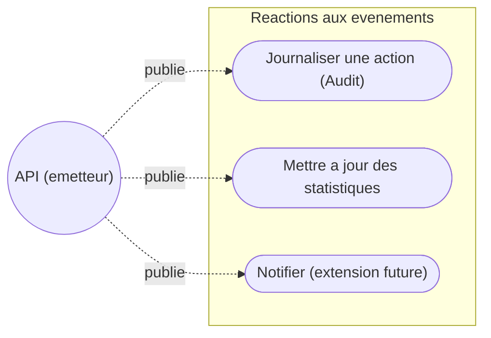
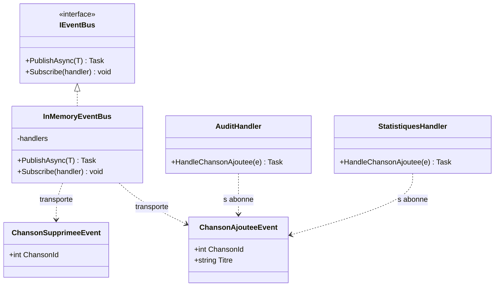
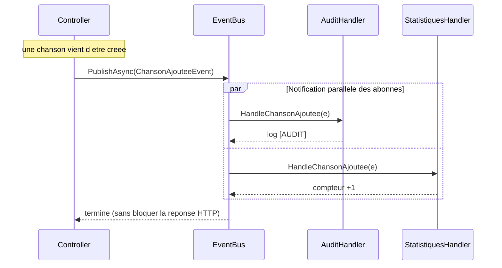
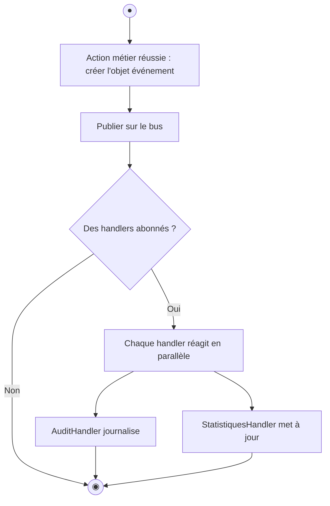
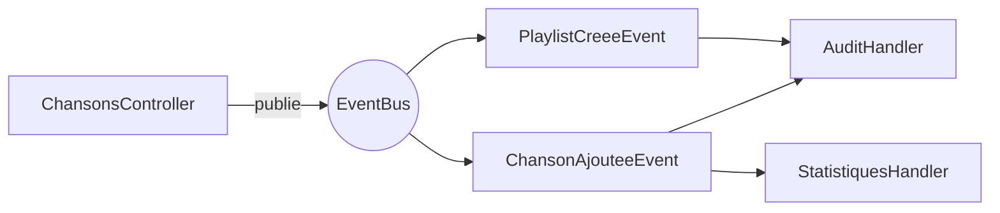

# 🎏 TP4 — Architecture orientée événements (EOA / EDA)

> **Module :** PlaylistApp (4/4) · **Durée : 4h** · Stack : .NET 10 · C# 14

> 🎓 **Concepts associés — à lire EN PREMIER** (explication + auto-évaluation) : [Événements & EOA](../cours/eoa.md)
>
> 👉 **Étape 1 du TP — avant de coder :** lisez ces fiches et réussissez leur **auto-évaluation**. (Le comparatif et le choix de chaque notion y sont aussi détaillés.)

> **Démarche :** partir de l'API du TP3 → comprendre pourquoi et comment découpler avec des événements → l'étendre.

---

> 🏛️ **Enjeu d'architecture** — **Étendre sans casser** : remplacer des appels directs par des **événements (EOA)** pour découpler l'émetteur des réactions. Arbitrage : découplage/extensibilité vs lisibilité d'un appel direct.

## 1. Objectifs pédagogiques

À la fin de ce TP, vous serez capable de :

| # | Compétence visée | Niveau (Bloom) | Preuve |
|---|---|---|---|
| O1 | Expliquer le problème du couplage fort | Comprendre | Vous donnez un exemple concret |
| O2 | Décrire le patron publish/subscribe | Comprendre | Vous expliquez émetteur / bus / abonnés |
| O3 | Distinguer SOA (synchrone) et EOA (événements) | Analyser | Vous dites quand utiliser l'un ou l'autre |
| O4 | Publier un événement | Appliquer | Votre action déclenche un handler |
| O5 | Créer un événement et son handler | Créer | Un nouveau handler réagit à votre événement |

**Compétence BTS :** SLAM4 (déployer un service web — architectures avancées).
**Prérequis :** avoir terminé le TP3 (l'API REST fonctionne).

---

## 2. La théorie, pas à pas

> Lisez cette section **avant** de coder. Elle part d'un problème concret et construit la solution étape par étape.

### 2.1 Le problème : tout faire au même endroit

Au TP3, quand on crée une chanson, le Controller enregistre en base, puis renvoie 201. Très bien. Mais imaginez que la médiathèque veuille **aussi**, à chaque ajout de chanson :
- écrire une ligne dans un **journal d'audit** ;
- mettre à jour des **statistiques** ;
- demain, envoyer une **notification**, et après-demain autre chose…

**Solution naïve :** tout écrire dans le Controller.

```csharp
// ❌ Le Controller fait TOUT
public async Task<IActionResult> Create(Chanson c)
{
    await _repo.AjouterAsync(c);
    _journal.Ecrire("Chanson ajoutée: " + c.Titre);   // audit
    _stats.Incrementer();                              // statistiques
    _notif.Envoyer(c);                                 // notification
    return Created(...);
}
```

> ❓ **Qu'est-ce qui cloche ?** À chaque nouveau besoin, on doit **rouvrir et modifier le Controller**. Il grossit, devient fragile, et mélange des choses qui n'ont rien à voir (gérer le web ET l'audit ET les stats). C'est le **couplage fort** : tout dépend de tout.

### 2.2 L'idée libératrice : annoncer au lieu d'ordonner

Et si, au lieu d'**ordonner** chaque action, le Controller se contentait d'**annoncer un fait** : « une chanson vient d'être ajoutée » — et que **ceux que ça intéresse réagissent tout seuls** ?

> 📣 **Analogie de l'annonce :** dans une gare, le haut-parleur annonce « train pour Lyon, voie 3 ». Le haut-parleur ne sait pas **qui** écoute. Les voyageurs concernés réagissent ; les autres ignorent. Ajouter un voyageur ne change rien à l'annonce.

C'est exactement l'**architecture orientée événements** (EOA, ou EDA : *Event-Driven Architecture*).

### 2.3 Les 3 rôles du patron publish/subscribe

| Rôle | Qui | Fait quoi |
|---|---|---|
| **Émetteur** (publisher) | le Controller | publie un événement (« chanson ajoutée ») |
| **Bus d'événements** | `EventBus` | transporte l'événement vers les abonnés |
| **Abonnés** (subscribers / handlers) | `AuditHandler`, `StatistiquesHandler` | réagissent à l'événement |

L'émetteur **ne connaît pas** les abonnés. Il publie « dans le vide » ; le bus distribue.

```
   Controller ──publie──▶  EventBus  ──notifie──▶  AuditHandler
   (émetteur)                  │      ──notifie──▶  StatistiquesHandler
                               └──────notifie──▶   (futur handler…)
```

### 2.4 Pourquoi c'est mieux : le couplage faible

Pour ajouter une notification demain, on **n'ouvre plus le Controller**. On crée un nouveau handler, on l'abonne, c'est tout. Le Controller reste **inchangé**.

> 🧠 **La règle d'or de l'EOA :** « L'émetteur annonce un fait ; il ne sait pas — et ne veut pas savoir — qui réagit. » On ajoute des comportements **sans toucher au code existant**.

### 2.5 Un événement, c'est quoi en C# ?

Un événement est un **petit objet immuable** qui décrit un fait passé. En C# 14, on l'écrit avec un **record** (concis, immuable) :

```csharp
// Un fait : "telle chanson a été ajoutée, à tel moment"
public record ChansonAjouteeEvent(int ChansonId, string Titre, DateTime Date);
```

> 🧠 On nomme les événements **au passé** (« Ajoutée », « Supprimée ») : ils décrivent ce qui **s'est déjà produit**.

### 2.6 SOA ou EOA ? Les deux !

Ce ne sont pas des rivales : elles se **complètent**.

| | SOA (TP3) | EOA (TP4) |
|---|---|---|
| Question | « fais ceci et réponds-moi » | « ceci s'est produit, réagissez » |
| Couplage | direct (Controller → Repository) | découplé (via le bus) |
| Moment | synchrone (on attend la réponse) | asynchrone (on n'attend pas) |
| Idéal pour | l'action principale (créer, lire) | les effets de bord (audit, stats, notif) |

> Dans notre API : le POST **enregistre** la chanson en **SOA** (on attend que ce soit fait), puis **publie un événement** en **EOA** (les réactions se font sans bloquer la réponse HTTP).

---

## 3. Modélisation UML

### Diagramme de cas d'utilisation — qui réagit aux événements


> 🗺️ **Lire le diagramme de cas d'usage** : le **rond** est l'acteur (l'utilisateur, ou l'émetteur d'un événement) ; chaque **bulle** est une action / un cas d'usage ; les **traits** relient l'acteur aux actions qu'il peut déclencher.

### Diagramme de classes — bus, événements, handlers


> 🗺️ **Lire le diagramme de classes** : chaque boîte est une **classe** (ses attributs en haut, ses méthodes en bas). Le préfixe `+` = **public** (visible de l'extérieur), `-` = **privé** (interne). Les liens montrent les **relations** : `o--` composition (« contient/possède »), `-->` association/dépendance, `<|--` héritage.

### Diagramme de séquence — publication et réactions parallèles


> 🗺️ **Lire le diagramme de séquence** : chaque **colonne** est un participant (objet ou service) ; le **temps s'écoule de haut en bas**. Une flèche pleine `->>` = un **appel**, une flèche pointillée `-->>` = une **réponse/retour**. Un bloc `par` regroupe des actions exécutées **en parallèle**.

### Diagramme d'activité — le flux d'un événement


> 🗺️ **Lire le diagramme d'activité (UML)** : **●** = nœud initial (début) · **◉** = nœud final (fin) ; un **rectangle** = une action, un **losange** = une décision (chaque branche = une réponse), un **cylindre** = une base de données.

---

## 4. Mise en place — pas à pas

> Toujours le même projet `PlaylistAppAPI`. Cette fois, on s'intéresse au dossier `Events/`.

### Étape 1 — Lancer l'API
```bash
cd PlaylistAppAPI
dotnet run
```
✅ **Résultat attendu :** l'API démarre sur le port 5000.

### Étape 2 — Déclencher un événement et l'observer
Dans Swagger, faites un `POST /api/chansons` (créez une chanson).

✅ **Résultat attendu :** dans le **terminal** (les logs de l'API), une ligne `[AUDIT]` apparaît. **C'est un handler qui a réagi à l'événement, sans que le Controller ne l'appelle directement.** Voilà l'EOA en action.

### Étape 3 — Repérer le second handler
Cherchez aussi une ligne produite par `StatistiquesHandler`.

✅ **Résultat attendu :** **deux** réactions différentes au **même** événement. Un seul fait publié, plusieurs abonnés.

---

## 5. Comprendre l'exemple fourni

> 🔁 **Le câblage des événements** de ce projet (qui publie, qui réagit) :



> 🗺️ **Lire l'organigramme** : on suit le **sens des flèches** ; l'**étiquette** sur une flèche précise la condition ou l'action. Un **rectangle** = une étape/action, un **losange** = une décision (chaque branche = une réponse possible), un **cylindre** = une base de données (lorsqu'ils sont présents).


```
PlaylistAppAPI/Events/EventBus.cs   ← tout l'EOA est ici
```

Ce fichier contient, dans l'ordre :

| Élément | Rôle |
|---|---|
| `interface IEventBus` | le contrat : `PublishAsync` (publier) et `Subscribe` (s'abonner) |
| `class InMemoryEventBus` | l'implémentation : garde la liste des abonnés et les notifie |
| `record ChansonAjouteeEvent`, … | les **événements** (faits passés) |
| `class AuditHandler` | un abonné qui **journalise** |
| `class StatistiquesHandler` | un abonné qui **compte** |
| `AddEventBus(...)` | enregistre le bus et **abonne** les handlers au démarrage |

### Lecture guidée
1. Lisez `IEventBus` : deux méthodes seulement. C'est tout le contrat.
2. Lisez `PublishAsync` : il récupère les abonnés du type d'événement et les appelle.
3. Lisez `AddEventBus` : repérez les lignes `bus.Subscribe<...>(...)`. **C'est là que se font les abonnements.**

> 🧠 Remarquez : `AuditHandler` ne connaît pas le Controller, et le Controller ne connaît pas `AuditHandler`. Ils ne se « parlent » qu'à travers l'événement. **Découplage total.**

---

## 6. ✍️ S'approprier le code par la modification

> Rituel : **🎯 Objectif → 📝 Démarche → 🔍 Vérification → 💡 Indice**.

### ✍️ 🟢 Modification 1 (guidée) — Publier un événement à la suppression
**🎯 Objectif :** quand on supprime une chanson, publier `ChansonSupprimeeEvent` et le journaliser.
**📝 Démarche :**
1. Dans `ChansonsController.cs`, méthode `Delete`, après la suppression réussie, appelez `await _eventBus.PublishAsync(new ChansonSupprimeeEvent(...));`.
2. Dans `AddEventBus`, abonnez l'`AuditHandler` à ce type (sur le modèle existant).
3. Ajoutez la méthode de handler correspondante si besoin.
**🔍 Vérification :** un `DELETE` fait apparaître une ligne `[AUDIT] Chanson supprimée` dans les logs.
**💡 Indice :** `ChansonSupprimeeEvent` existe déjà dans `EventBus.cs`. Inspirez-vous de l'ajout déjà câblé.

### ✍️ 🟡 Modification 2 (semi-guidée) — Un handler « historique »
**🎯 Objectif :** créer un nouveau handler `HistoriqueHandler` qui garde en mémoire la liste des derniers événements.
**📝 Démarche :**
1. Créez la classe `HistoriqueHandler` avec une `List<string>` interne.
2. Écrivez une méthode qui ajoute une ligne décrivant l'événement reçu.
3. Enregistrez-la et abonnez-la dans `AddEventBus`.
**🔍 Vérification :** après plusieurs actions, l'historique contient bien une entrée par événement.
**💡 Indice :** calquez la structure de `StatistiquesHandler` (constructeur primaire + méthode `Handle...`).

### ✍️ 🔴 Modification 3 (autonome) — Un événement métier complet
**🎯 Objectif :** créer de A à Z un événement `NoteModifieeEvent` (déclenché quand on change la note d'une chanson), avec publication et au moins un handler abonné.
**📝 Démarche (à structurer) :** définir le record, publier depuis l'endpoint concerné, créer/abonner un handler.
**🔍 Vérification :** modifier une note produit la réaction attendue dans les logs.
**💡 Indice :** un événement = un `record` au passé ; n'oubliez pas le `Subscribe<...>` dans `AddEventBus`.

---

## 7. Valider avec les tests

```bash
dotnet test ../PlaylistAppAPI.Tests/
```
✅ **Résultat attendu :** les tests existants restent au vert (8). **Bonus :** écrivez un test qui vérifie qu'après une publication, un handler a bien réagi (ex. compteur incrémenté).

---

## 8. ✅ Validation finale — checklist
- [ ] 🎓 J'ai coché mes missions dans `PROGRESSION.md` et committé
- [ ] Je vois les lignes `[AUDIT]` et statistiques après un POST
- [ ] **Modification 1** : événement de suppression journalisé
- [ ] **Modification 2** : `HistoriqueHandler` fonctionnel
- [ ] **Modification 3** : événement `NoteModifieeEvent` complet
- [ ] Les tests restent au vert
- [ ] Commits réguliers

---

## 9. Auto-évaluation (compréhension)
- [ ] Je peux expliquer le problème du couplage fort
- [ ] Je peux décrire les 3 rôles : émetteur, bus, abonnés
- [ ] Je sais pourquoi l'émetteur ne connaît pas ses abonnés
- [ ] Je sais quand préférer SOA et quand préférer EOA

---

## 10. Dépannage
| Problème | Solution |
|---|---|
| Aucune ligne `[AUDIT]` | L'événement est-il bien **publié** ? le handler est-il **abonné** dans `AddEventBus` ? |
| Mon nouvel handler ne réagit pas | Vérifiez le `Subscribe<MonEvent>(...)` et que le **type** d'événement correspond |
| Erreur de compilation sur un record | Un record se déclare en une ligne : `public record X(int A, string B);` |

---

## 11. Bilan des 4 TP

Vous êtes parti d'une console (TP1), vous lui avez donné une mémoire durable (TP2), vous l'avez ouverte au monde via une API REST en couches (TP3), et vous l'avez rendue **extensible sans la modifier** grâce aux événements (TP4). C'est toute la trajectoire d'une application moderne : **fonctionner, persister, exposer, évoluer**.

⬅️ **TP précédent :** [TP3 — API REST & SOA](TP3_GUIDE.md)

🧭 **[Retour au parcours](../PARCOURS_TP.md)**
