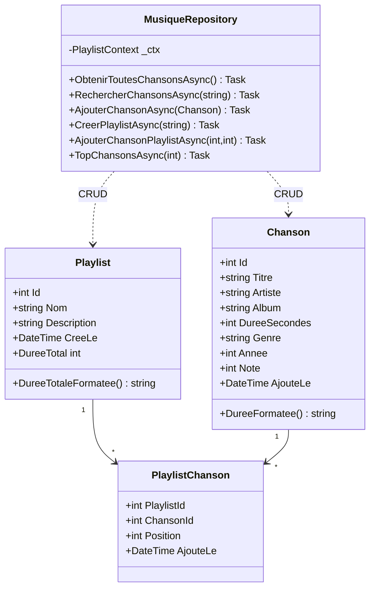
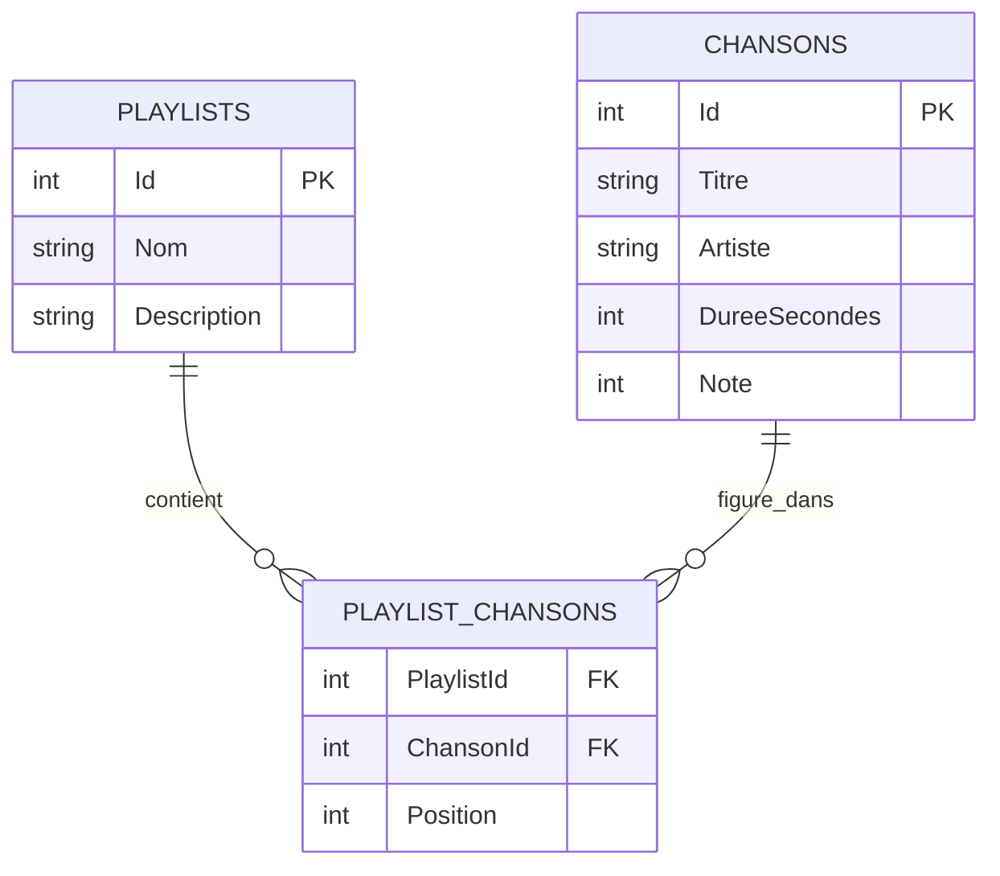

# 🎵 PlaylistApp EF – TP2 : Entity Framework Core & SQLite dans Docker


> **Référence GitHub :** [jasonsturges/sqlite-dotnet-core](https://github.com/jasonsturges/sqlite-dotnet-core)
> (.NET 10 Console + SQLite + EF Core + Injection de Dépendances)

---

## 📌 Objectif pédagogique

Ce TP fait suite au TP1 (collections en mémoire) en introduisant la **persistance des données** avec Entity Framework Core et SQLite dans un conteneur Docker.

| Concept EF Core | Mise en œuvre dans le projet |
|---|---|
| `DbContext` | `PlaylistContext` : point d'entrée vers la BD |
| `DbSet<T>` | Tables `Chansons`, `Playlists`, `PlaylistChansons` |
| Annotations de données | `[Key]`, `[Required]`, `[MaxLength]`, `[Range]` |
| Fluent API | Relations, index, clé composite dans `OnModelCreating` |
| Migrations | Script SQL versionné, appliqué au démarrage |
| Eager Loading | `.Include().ThenInclude()` pour charger les relations |
| LINQ to SQL | Requêtes traduites en SQL par EF Core |
| Seed Data | Données initiales dans `OnModelCreating` |
| Suppression en cascade | `OnDelete(DeleteBehavior.Cascade)` |
| Programmation asynchrone | `async/await` + méthodes `*Async()` |
| Volume Docker | Persistance de la BD SQLite entre redémarrages |

---

## 🗂 Structure du projet

```
PlaylistAppEF/
├── Dockerfile              ← Build multi-étapes (SDK → Runtime)
├── docker-compose.yml      ← Orchestration + volume persistant
├── .dockerignore
├── PlaylistAppEF.csproj    ← EF Core SQLite + Design
├── Program.cs              ← Menu console asynchrone
│
├── Data/
│   └── PlaylistContext.cs  ← DbContext (cœur d'EF Core)
│
├── Models/
│   ├── Chanson.cs          ← Entité + DataAnnotations
│   ├── Playlist.cs         ← Entité + propriétés calculées [NotMapped]
│   └── PlaylistChanson.cs  ← Table de jonction N-N (avec données)
│
└── Repositories/
    └── MusiqueRepository.cs ← Couche accès données (CRUD async)
```

---

## 🗄 Schéma de base de données

```
┌─────────────────────┐       ┌───────────────────────┐
│      Chansons       │       │       Playlists        │
├─────────────────────┤       ├───────────────────────┤
│ Id          PK      │       │ Id          PK         │
│ Titre       NN      │       │ Nom         NN UNIQUE  │
│ Artiste     NN      │       │ Description            │
│ Album       NN      │       │ CreeLe                 │
│ DureeSecondes       │       │ ModifieLe              │
│ Genre               │       └───────────┬───────────┘
│ Annee               │                   │
│ Note (1-5)          │                   │
│ AjouteLe            │                   │
└──────────┬──────────┘                   │
           │                              │
           └──────────┬───────────────────┘
                      │
           ┌──────────▼────────────┐
           │    PlaylistChansons   │  ← Table de jonction
           ├───────────────────────┤
           │ PlaylistId  PK, FK    │──→ Playlists.Id (CASCADE)
           │ ChansonId   PK, FK    │──→ Chansons.Id  (RESTRICT)
           │ Position              │
           │ AjouteLe              │
           └───────────────────────┘
```

---


## 🧩 Documentation technique — Diagrammes

### Diagramme de classes (entités + accès aux données)



### Modèle relationnel (entité-association)

La relation N-N entre `Chansons` et `Playlists` passe par la table de liaison `Playlist_Chansons` :



## 🚀 Démarrage rapide

### Option A – Docker Compose (recommandée en TP)
```bash
# Builder et lancer (la BD est créée automatiquement au premier démarrage)
docker compose up --build

# Relancer (la BD est persistée dans le volume)
docker compose up

# Voir les logs
docker compose logs

# Supprimer le volume (repart de zéro)
docker compose down -v
```

### Option B – Docker seul
```bash
# Builder l'image
docker build -t playlist-app-ef .

# Créer un volume nommé
docker volume create playlist-ef-data

# Lancer avec le volume
docker run -it -v playlist-ef-data:/data -e DB_PATH=/data playlist-app-ef

# Inspecter le volume (vérifier que la BD est créée)
docker volume inspect playlist-ef-data
```

### Option C – Sans Docker (.NET SDK 8 requis)
```bash
# Restaurer les paquets
dotnet restore

# Installer l'outil EF (une seule fois)
dotnet tool install --global dotnet-ef

# Créer la migration initiale
dotnet ef migrations add MigrationInitiale

# Appliquer la migration (crée playlist.db)
dotnet ef database update

# Lancer l'application
dotnet run
```

---

## 🔍 Commandes EF Core utiles

```bash
# Créer une nouvelle migration (après modification du modèle)
dotnet ef migrations add NomDeLaMigration

# Voir la liste des migrations
dotnet ef migrations list

# Appliquer les migrations en attente
dotnet ef database update

# Revenir à une migration précédente
dotnet ef database update NomDeLaMigrationPrecedente

# Supprimer la dernière migration (non encore appliquée)
dotnet ef migrations remove

# Générer le script SQL d'une migration
dotnet ef migrations script
```

---

## 📝 Exercices TP2

### Exercice 1 – Prise en main (20 min)
1. Cloner le projet et lancer avec `docker compose up --build`
2. Vérifier que les données de démarrage sont présentes (option 1)
3. Ajouter 2 nouvelles chansons (option 3)
4. Créer une playlist et y ajouter des chansons (options 9, 10)
5. Relancer le conteneur → vérifier que les données sont persistées

### Exercice 2 – Évolution du modèle (30 min)
Ajouter une entité `Artiste` avec les propriétés :
- `Id`, `Nom`, `Pays`, `DateCreation`
- Relation 1-N vers `Chanson`

Étapes :
1. Créer `Models/Artiste.cs` avec les annotations
2. Ajouter `DbSet<Artiste> Artistes` dans `PlaylistContext`
3. Configurer la relation dans `OnModelCreating`
4. Créer la migration : `dotnet ef migrations add AjoutArtiste`
5. Appliquer : `dotnet ef database update`

### Exercice 3 – Requêtes LINQ avancées (20 min)
Dans `MusiqueRepository.cs`, implémenter :
```csharp
// Chansons par décennie
Task<Dictionary<int, int>> ChansonsParDecennieAsync();

// Durée totale par genre
Task<List<(string Genre, TimeSpan Duree)>> DureesParGenreAsync();

// Playlists contenant un artiste donné
Task<List<Playlist>> PlaylistsAvecArtisteAsync(string artiste);
```

### Exercice 4 – Export JSON (bonus)
Exporter la bibliothèque complète en JSON avec `System.Text.Json` :
```csharp
var chansons = await repo.ObtenirToutesChansonsAsync();
string json = JsonSerializer.Serialize(chansons, new JsonSerializerOptions { WriteIndented = true });
await File.WriteAllTextAsync("/data/export.json", json);
```

---

## 📦 Technologies utilisées

| Technologie | Version | Rôle |
|---|---|---|
| C# | 12 | Langage de développement |
| .NET | 8 LTS | Environnement d'exécution |
| EF Core | 8.0.10 | ORM (mapping objet-relationnel) |
| SQLite | Embarqué | Base de données légère |
| Docker | 24+ | Conteneurisation |
| docker compose | V2 | Orchestration + volumes |

---

## 🔗 Ressources

- ⭐ [GitHub de référence – jasonsturges/sqlite-dotnet-core](https://github.com/jasonsturges/sqlite-dotnet-core)
- [EF Core – Documentation Microsoft](https://learn.microsoft.com/fr-fr/ef/core/)
- [Migrations EF Core](https://learn.microsoft.com/fr-fr/ef/core/managing-schemas/migrations/)
- [SQLite avec EF Core](https://learn.microsoft.com/fr-fr/ef/core/providers/sqlite/)
- [Tutoriel complet EF Core + SQLite (en)](https://www.ottorinobruni.com/how-to-integrate-entity-framework-core-with-dotnet-console-application-using-csharp-and-vscode/)
