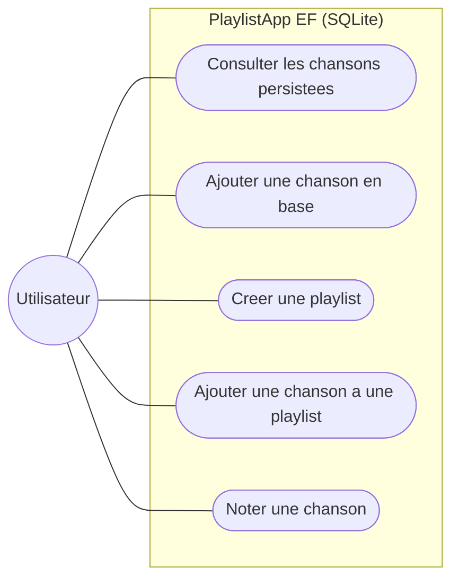
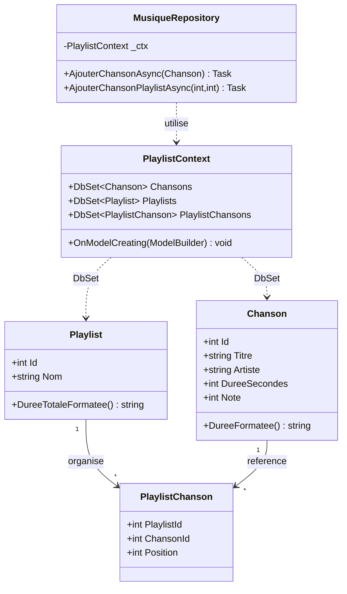
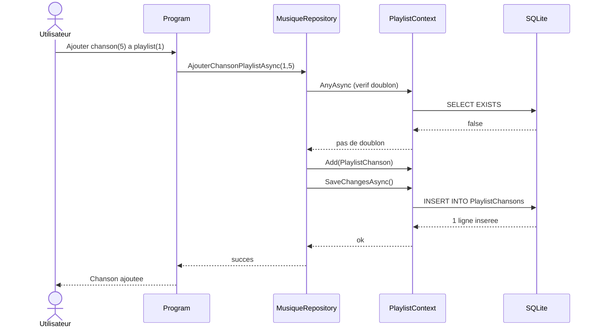
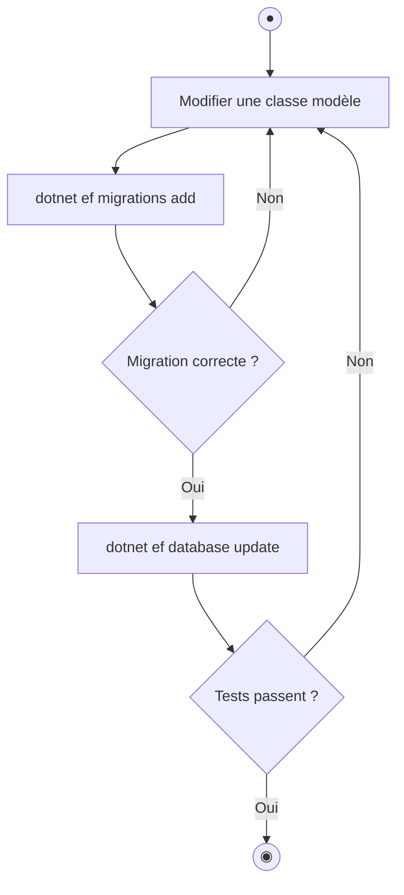
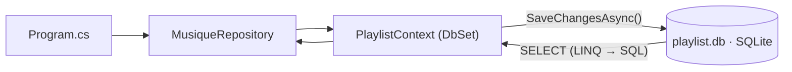

# 📗 TP2 — Persistance des données avec Entity Framework Core

> **Module :** PlaylistApp (2/4) · **Durée : 6h**

> 🎓 **Concepts associés — à lire EN PREMIER** (explication + auto-évaluation) : [ORM](../cours/orm.md) · [Migrations](../cours/migrations.md) · [Relations](../cours/relations.md)
>
> 👉 **Étape 1 du TP — avant de coder :** lisez ces fiches et réussissez leur **auto-évaluation**. (Le comparatif et le choix de chaque notion y sont aussi détaillés.)

> **Démarche :** partir d'un exemple fonctionnel → comprendre l'ORM → se l'approprier en faisant évoluer le modèle de données.

---

> 🏛️ **Enjeu d'architecture** — Décider **comment persister** les données : un **ORM** (productivité) plutôt que du SQL à la main, et faire évoluer le schéma par **migrations** (traçable, sans perte). Arbitrage : confort/portabilité vs contrôle fin du SQL.

## 1. Objectifs pédagogiques

À la fin de ce TP, vous serez capable de :

| # | Compétence visée | Comment vous la prouverez |
|---|---|---|
| O1 | Expliquer ce qu'est un ORM | Vous direz ce que fait EF Core entre C# et SQL |
| O2 | Mettre en place un `DbContext` | Vous ajouterez une nouvelle table |
| O3 | Gérer une migration | Vous générerez et appliquerez une migration |
| O4 | Modéliser une relation entre tables | Vous créerez une relation 1-N |
| O5 | Valider votre code avec des tests | `dotnet test` passera au vert |

**Compétences BTS :** SLAM3 (gérer les données), SLAM2 (validation par les tests).
**Prérequis :** avoir terminé le TP1. Aucune installation locale.

---

## 2. Contexte métier & limite du TP1

> Dans le TP1, dès qu'on ferme l'application, **toutes les données disparaissent** (elles n'existent qu'en mémoire). Inacceptable pour la médiathèque : il faut **conserver** les chansons et playlists entre deux utilisations. La solution professionnelle : une **base de données**. On utilise SQLite (légère, sans serveur) pilotée par **Entity Framework Core**, l'ORM de référence en .NET.

> 🧠 **ORM = Object-Relational Mapping.** EF Core fait automatiquement le pont entre vos **classes C#** et des **tables SQL**. Vous écrivez du C#, EF Core génère le SQL. Vous ne tapez (presque) jamais de SQL à la main.

---

## 3. Modélisation UML

> Les 4 vues UML de ce TP. La nouveauté par rapport au TP1 : la persistance en base (DbContext, table de liaison).

### Diagramme de cas d'utilisation


> 🗺️ **Lire le diagramme de cas d'usage** : le **rond** est l'acteur (l'utilisateur, ou l'émetteur d'un événement) ; chaque **bulle** est une action / un cas d'usage ; les **traits** relient l'acteur aux actions qu'il peut déclencher.

### Diagramme de classes
Notez la table de liaison `PlaylistChanson` (relation N-N) et le `PlaylistContext` qui expose les `DbSet`.



> 🗺️ **Lire le diagramme de classes** : chaque boîte est une **classe** (ses attributs en haut, ses méthodes en bas). Le préfixe `+` = **public** (visible de l'extérieur), `-` = **privé** (interne). Les liens montrent les **relations** : `o--` composition (« contient/possède »), `-->` association/dépendance, `<|--` héritage.

### Diagramme de séquence — « ajouter une chanson à une playlist » via EF Core
Observez le passage par le Repository, le DbContext, puis SQLite.



> 🗺️ **Lire le diagramme de séquence** : chaque **colonne** est un participant (objet ou service) ; le **temps s'écoule de haut en bas**. Une flèche pleine `->>` = un **appel**, une flèche pointillée `-->>` = une **réponse/retour**. Un bloc `par` regroupe des actions exécutées **en parallèle**.

### Diagramme d'activité — le cycle d'une migration
La démarche professionnelle : modifier le modèle, migrer, valider.



> 🗺️ **Lire le diagramme d'activité (UML)** : **●** = nœud initial (début) · **◉** = nœud final (fin) ; un **rectangle** = une action, un **losange** = une décision (chaque branche = une réponse), un **cylindre** = une base de données.

---

## 4. Mise en place de l'environnement — pas à pas

> ⚠️ Vous travaillez dans le **même dépôt et le même Codespace** que le TP1. Pas besoin d'en recréer.

### Étape 1 — Se placer dans le bon projet
```bash
cd PlaylistAppEF
```
✅ **Résultat attendu :** votre terminal est dans le dossier `PlaylistAppEF`.

### Étape 2 — Vérifier l'outil de migration
```bash
dotnet ef --version
```
✅ **Résultat attendu :** une version `Entity Framework Core ... 8.x` s'affiche.
*(Si « command not found » : `dotnet tool install --global dotnet-ef` puis réessayez.)*

### Étape 3 — Appliquer la migration fournie (créer la base)
```bash
dotnet ef database update
```
✅ **Résultat attendu :** un message `Applying migration ...` puis `Done.`. Un fichier `playlist.db` est créé.

### Étape 4 — Lancer l'application
```bash
dotnet run
```
✅ **Résultat attendu :** le menu s'affiche, et `1` (lister) montre **12 chansons** déjà présentes (les données initiales, dites *seed*).

### Étape 5 — Vérifier la persistance (le point clé du TP)
1. Ajoutez une chanson via le menu (option 3).
2. Quittez (`0`).
3. Relancez `dotnet run` et listez à nouveau.

✅ **Résultat attendu :** **votre chanson est toujours là.** C'est la différence fondamentale avec le TP1 : les données survivent à la fermeture.

---

## 5. Comprendre l'exemple fourni

> 🔁 **Le chemin d'une donnée jusqu'à SQLite** dans ce projet :



> 🗺️ **Lire l'organigramme** : on suit le **sens des flèches** ; l'**étiquette** sur une flèche précise la condition ou l'action. Un **rectangle** = une étape/action, un **losange** = une décision (chaque branche = une réponse possible), un **cylindre** = une base de données (lorsqu'ils sont présents).


```
PlaylistAppEF/
├── Models/
│   ├── Chanson.cs           ← Entité = future table "Chansons"
│   ├── Playlist.cs          ← Entité = future table "Playlists"
│   └── PlaylistChanson.cs   ← Table de liaison (relation N-N)
├── Data/
│   └── PlaylistContext.cs   ← LE fichier central d'EF Core
├── Repositories/
│   └── MusiqueRepository.cs ← Toutes les opérations sur la base (CRUD)
├── Migrations/              ← Scripts SQL versionnés générés par EF Core
└── Program.cs               ← Menu (asynchrone cette fois)
```

### Lecture guidée — dans cet ordre

**1. `Models/Chanson.cs`** — une entité = une table.
Repérez les **annotations** qui configurent la base :
- `[Key]` → clé primaire.
- `[Required]` → champ obligatoire (NOT NULL).
- `[MaxLength(200)]` → taille maximale de la colonne.

> 🧠 Ces annotations sont des **instructions pour EF Core** : elles décrivent à quoi ressemblera la colonne en base.

**2. `Data/PlaylistContext.cs`** — le cœur du système. Le fichier le plus important.
Repérez :
- Les `DbSet<Chanson>`, `DbSet<Playlist>` : **chaque `DbSet` = une table**.
- `OnModelCreating(...)` : configure les relations et insère les données de démo (`HasData`).
- Les deux constructeurs : un pour la console (configure SQLite), un pour les tests (reçoit des options).

**3. `Models/PlaylistChanson.cs`** — la relation N-N.
> Une chanson peut être dans plusieurs playlists, et une playlist contient plusieurs chansons. En base, ça se modélise par une **table de liaison** avec deux clés étrangères. C'est un point classique du référentiel BTS (MLD).

**4. `Repositories/MusiqueRepository.cs`** — l'accès aux données.
Toutes les méthodes sont `async` (asynchrones) et utilisent LINQ traduit en SQL par EF Core (ex. `.Where()`, `.Include()`).

> 📌 **Schéma mental :**
> `Program.cs` → `MusiqueRepository` → `PlaylistContext` → SQLite (`playlist.db`)

---

## 6. Comprendre les migrations (notion clé)

Une **migration** est un script qui décrit comment passer le schéma de la base d'un état à un autre. EF Core les **versionne** (comme Git pour le code).

```bash
# Voir l'historique des migrations
dotnet ef migrations list

# Créer une nouvelle migration après avoir modifié un modèle
dotnet ef migrations add NomDeMaMigration

# Appliquer les migrations en attente à la base
dotnet ef database update
```

> 🧠 **À retenir :** on ne modifie **jamais** la base à la main. On modifie les **classes C#**, on génère une **migration**, puis on l'**applique**. Traçabilité totale.

---

## 7. ✍️ S'approprier le code par la modification

> **Cœur du TP.** Vous allez faire évoluer le modèle de données, ce qui est l'activité la plus fréquente d'un développeur SLAM. Rituel : **Objectif → Démarche → Vérification → Indice**.

### ✍️ 🟢 Modification 1 (guidée) — Ajouter un champ « Label » (maison de disque)

**🎯 Objectif :** chaque chanson stockera le nom de son label.

**📝 Démarche :**
1. Dans `Models/Chanson.cs`, ajoutez une propriété `Label` de type `string` avec `[MaxLength(100)]`.
2. Générez la migration : `dotnet ef migrations add AjoutLabel`.
3. Appliquez-la : `dotnet ef database update`.
4. Vérifiez dans le fichier de migration créé qu'une colonne `Label` est bien ajoutée.

**🔍 Vérification :** ouvrez `playlist.db` avec l'extension *SQLite Viewer* (clic droit sur le fichier) → la table `Chansons` a une colonne `Label`.

**💡 Indice :** `public string Label { get; set; } = string.Empty;`

---

### ✍️ 🟡 Modification 2 (semi-guidée) — Une méthode « chansons par genre »

**🎯 Objectif :** ajouter au Repository une méthode qui renvoie les chansons d'un genre, triées par note décroissante.

**📝 Démarche :**
1. Dans `MusiqueRepository.cs`, ajoutez une méthode `async Task<List<Chanson>> ParGenreAsync(string genre)`.
2. Utilisez LINQ pour filtrer puis trier.
3. Appelez-la depuis le menu de `Program.cs`.

**🔍 Vérification :** demander le genre « Rock » renvoie uniquement les chansons Rock, la mieux notée en premier.

**💡 Indice :** `await _ctx.Chansons.Where(c => c.Genre == genre).OrderByDescending(c => c.Note).ToListAsync();`

---

### ✍️ 🔴 Modification 3 (autonome) — Ajouter une entité `Artiste` (relation 1-N)

**🎯 Objectif :** créer une vraie table `Artistes` reliée aux chansons (un artiste → plusieurs chansons).

**📝 Démarche (à structurer vous-même) :**
1. Créez `Models/Artiste.cs` (Id, Nom, Pays) avec les bonnes annotations.
2. Ajoutez `public DbSet<Artiste> Artistes { get; set; }` dans le contexte.
3. Configurez la relation 1-N dans `OnModelCreating`.
4. Générez et appliquez une migration `AjoutArtiste`.

**🔍 Vérification :** la table `Artistes` existe dans `playlist.db` et possède une clé étrangère depuis `Chansons`.

**💡 Indice :** pour la date de création de l'artiste, utilisez une **date fixe** (ex. `new DateTime(2025,1,1)`), **jamais** `DateTime.UtcNow` → sinon vous créerez des migrations « fantômes » à chaque génération (piège classique !).

---

## 8. Valider avec les tests automatiques

**🎯 Objectif :** prouver que votre code fonctionne, sans tester à la main.

```bash
dotnet test ../PlaylistAppEF.Tests/
```
✅ **Résultat attendu :** `Passed! - Failed: 0, Passed: 31`.

> 🧠 Ouvrez `PlaylistAppEF.Tests/RepositoryTests.cs`. Observez la structure **AAA** : *Arrange* (préparer), *Act* (agir), *Assert* (vérifier). C'est le standard professionnel des tests.

Si vous avez ajouté `ParGenreAsync` (Modification 2), **écrivez votre propre test** pour elle, en vous inspirant des existants. C'est un excellent réflexe SLAM2.

---

## 9. 🐳 Conteneuriser avec persistance

> ℹ️ **À distinguer du TP0** : le `.devcontainer` (TP0) conteneurise votre **environnement de dev** ; **ici, on conteneurise l'application** (le livrable) pour l'exécuter / la déployer. C'est la compétence « mettre à disposition un service » (B1.5 / SPR5).

```bash
docker compose up --build
```
✅ **Résultat attendu :** l'app démarre. La base SQLite est stockée dans un **volume Docker** → les données persistent même si on supprime le conteneur.

> 🧠 Ouvrez `docker-compose.yml`. Repérez la section `volumes:`. C'est elle qui garantit la persistance entre les redémarrages.

---

## 10. ✅ Validation finale — checklist

- [ ] 🎓 J'ai coché mes missions dans `PROGRESSION.md` et committé
- [ ] La base se crée (`dotnet ef database update`)
- [ ] Les données persistent après redémarrage
- [ ] **Modification 1** : colonne `Label` ajoutée (visible dans SQLite Viewer)
- [ ] **Modification 2** : méthode « par genre » fonctionnelle
- [ ] **Modification 3** : table `Artistes` créée avec relation
- [ ] `dotnet test` → 31 tests verts (32+ si vous avez ajouté le vôtre)
- [ ] `docker compose up` démarre l'app
- [ ] Commits réguliers avec messages clairs

---

## 11. Dépannage

| Problème | Solution |
|---|---|
| `dotnet ef : command not found` | `dotnet tool install --global dotnet-ef` |
| `no such table: Chansons` | Vous avez oublié `dotnet ef database update` |
| Migration « fantôme » (re-update à chaque fois) | Vous avez un `DateTime.UtcNow` dans le seed → mettez une date fixe |
| Les tests échouent après ma modif | Lisez le message : le test vous dit ce qui ne va pas. C'est normal et formateur. |
| Je veux repartir de zéro | `rm playlist.db` puis `dotnet ef database update` |

---

⬅️ **TP précédent :** [TP1 — Console & POO](../PlaylistApp/TP1_GUIDE.md)
➡️ **TP suivant :** [TP3 — API REST & SOA](../PlaylistAppAPI/TP3_GUIDE.md)

🧭 **[Retour au parcours](../PARCOURS_TP.md)**
