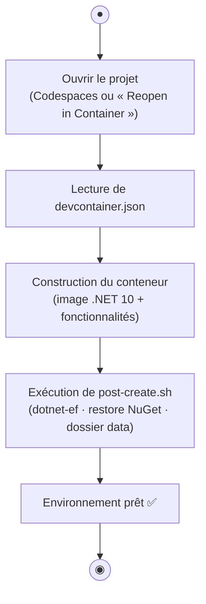
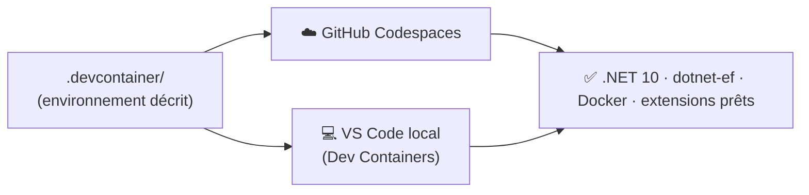

# 🚀 TP0 — Mettre en place l'environnement

> **Module :** PlaylistApp (0/4) · **Durée : ~30 min** · Stack : .NET 10 · C# 14

> 🎓 **Concepts associés — à lire EN PREMIER** (explication + auto-évaluation) : [Environnement de développement (Dev Container)](cours/environnement.md)
>
> 👉 **Étape 1 du TP — avant de coder :** lisez cette fiche et réussissez son auto-évaluation. (Le comparatif et le choix y sont aussi détaillés.)

> **Démarche :** partir d'un environnement **décrit** (`.devcontainer`) → comprendre comment il est reconstruit → le faire tourner en **Codespaces** ou en **local**, puis lancer l'application.

> 🔑 **Icônes :** ✍️ à faire · 🎓 concept + auto-évaluation · ✅ valider · 🐳 Docker.

---

> 🏛️ **Enjeu d'architecture** — Un environnement **reproductible** (identique pour tout le monde, fini le « ça marche chez moi ») est la fondation d'un projet sérieux. Le dossier `.devcontainer` **décrit** l'environnement ; Codespaces (cloud) ou VS Code (local) le **recréent à l'identique**.

## 1. Objectifs pédagogiques

| # | Objectif | Vous saurez… |
|---|---|---|
| O1 | Comprendre l'intérêt d'un environnement reproductible | expliquer pourquoi on décrit l'environnement dans le code |
| O2 | Distinguer **image** et **conteneur** (Docker) | dire ce que produit le `.devcontainer` |
| O3 | Lancer l'application | obtenir le menu via `dotnet run` |
| O4 | Choisir sa voie | Codespaces (cloud) **ou** VS Code local |

## 2. La théorie, pas à pas

Un **Dev Container** est un environnement de développement **décrit par du code**, dans le dossier `.devcontainer/`. Deux fichiers clés :

| Fichier | Rôle |
|---|---|
| `.devcontainer/devcontainer.json` | **décrit** l'environnement : image .NET 10, fonctionnalités (Docker, Git), **extensions VS Code** (C# Dev Kit, Docker, SQLite Viewer, REST Client), ports (5000/5001) |
| `.devcontainer/post-create.sh` | **script lancé une fois** après création : installe `dotnet-ef`, restaure NuGet, prépare le dossier de données SQLite |

> 🧠 Détails et auto-évaluation dans la fiche concept : **[Environnement de développement](cours/environnement.md)**.

> ℹ️ **Deux usages de Docker à ne pas confondre :** **ici (TP0)**, Docker sert à recréer **votre environnement de développement** (le Dev Container où vous écrivez et exécutez le code). **Aux TP1 → TP3**, vous conteneuriserez **l'application elle-même** (un `Dockerfile` qui empaquette le programme pour l'exécuter / le livrer) — autre usage, côté **déploiement**.

## 3. Modélisation

### Diagramme d'activité — le cycle de construction



> 🗺️ **Lire le diagramme d'activité (UML)** : **●** = nœud initial (début) · **◉** = nœud final (fin) ; un **rectangle** = une action, un **losange** = une décision (chaque branche = une réponse), un **cylindre** = une base de données.

### Diagramme — un seul descriptif, deux voies



> 🗺️ **Légende** : le **même** `.devcontainer` produit le **même environnement**, en cloud (Codespaces) comme en local.

## 4. ✍️ Mise en place — pas à pas

### Voie A — GitHub Codespaces (recommandé · zéro installation)

1. Sur votre dépôt : **Code → Codespaces → Create codespace on main**.
2. Patientez ~2 min : VS Code s'ouvre **dans le navigateur**, l'environnement se construit depuis le `.devcontainer`.

✅ **Résultat attendu :** VS Code en ligne, terminal prêt, .NET 10 disponible.

### Voie B — En local avec VS Code

Deux options selon que vous utilisez ou non le conteneur.

#### B1 — Avec le Dev Container (recommandé en local)

Vous n'installez **que** ces trois éléments :

| Outil | Où l'obtenir |
|---|---|
| **VS Code** | <https://code.visualstudio.com/> |
| **Docker Desktop** | <https://www.docker.com/products/docker-desktop/> |
| Extension **Dev Containers** | dans VS Code, installez `ms-vscode-remote.remote-containers` |

➡️ **.NET 10, `dotnet-ef` et Docker sont fournis par le conteneur** (décrits dans `.devcontainer`) : **rien d'autre à installer**.

1. Clonez votre dépôt, puis ouvrez le dossier dans VS Code (Docker Desktop doit tourner).
2. `F1` → *Dev Containers: Reopen in Container*.

✅ **Résultat attendu :** le même environnement qu'en Codespaces, sur votre machine.

#### B2 — Installation native (sans conteneur)

Si vous préférez tout installer directement (pas de Docker pour développer) :

**1️⃣ .NET 10 SDK** — le compilateur et l'outillage C#
- 📥 Page officielle : <https://dotnet.microsoft.com/download/dotnet/10.0>
- **Windows** : `winget install Microsoft.DotNet.SDK.10`
- **macOS** : `brew install --cask dotnet-sdk` (ou le `.pkg` de la page officielle)
- **Linux (Ubuntu/Debian)** : `sudo apt-get update && sudo apt-get install -y dotnet-sdk-10.0` *(dépôt `packages.microsoft.com`)* — ou le script `https://dot.net/v1/dotnet-install.sh --channel 10.0`
- ✅ **Vérifier** : `dotnet --version` → doit afficher `10.x`

**2️⃣ dotnet-ef** — l'outil Entity Framework Core (migrations, utilisé au TP2)
```bash
dotnet tool install --global dotnet-ef
# Si "dotnet ef : command not found" ensuite, ajoutez les outils au PATH :
export PATH="$PATH:$HOME/.dotnet/tools"        # bash / zsh (à mettre dans ~/.bashrc)
```
- ✅ **Vérifier** : `dotnet ef --version`

**3️⃣ Docker Desktop** — pour conteneuriser l'**application** (TP1 build, TP2/TP3 `docker compose`)
- 📥 <https://www.docker.com/products/docker-desktop/> (Windows/macOS) · sous Linux : **Docker Engine**
- ✅ **Vérifier** : `docker --version`

> 💡 Le **Dev Container (B1)** reste recommandé : il garantit **la même version** pour tout le monde. En installation native, les versions peuvent diverger d'une machine à l'autre (« ça marche chez moi »).

> 🐳 **Rappel :** Docker ici sert (B1) à votre environnement de dev **et** (TP1→TP3) à conteneuriser l'application — voir la note du §2.

## 5. ✍️ Lancer et vérifier l'application

```bash
cd PlaylistApp
dotnet run
```

✅ **Résultat attendu :** le menu de l'application s'affiche. Testez-le : `1` liste les chansons, `2` recherche, `0` quitte. **L'environnement fonctionne — vous pouvez passer au TP1.**

## 6. ✅ Validation finale — checklist

- [ ] 🎓 J'ai lu la fiche [Environnement de développement](cours/environnement.md) et réussi son auto-évaluation
- [ ] Mon environnement est prêt (Codespaces **ou** Dev Container local)
- [ ] `dotnet run` affiche le menu de l'application
- [ ] Je sais distinguer une **image** d'un **conteneur**, et à quoi sert `.devcontainer`
- [ ] 🎓 J'ai coché mes missions dans `PROGRESSION.md`

## 7. Dépannage

| Problème | Solution |
|---|---|
| `dotnet : command not found` | Reconstruisez l'environnement : `F1` → *Rebuild Container* (ou recréez le Codespace) |
| Docker ne démarre pas (local) | Lancez **Docker Desktop** avant d'ouvrir le conteneur |
| 1re construction longue | Normal : l'image se télécharge une fois, puis elle est mise en cache |
| Le menu ne s'affiche pas | Êtes-vous bien dans le dossier `PlaylistApp` (`cd PlaylistApp`) ? |

---

➡️ **TP suivant :** [TP1 — Console & POO](PlaylistApp/TP1_GUIDE.md)
🧭 **[Retour au parcours](PARCOURS_TP.md)**
