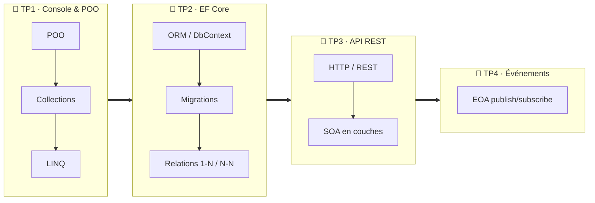

# 🎓 Concepts de cours & auto-évaluations

> Pour chaque TP, une fiche de concept **explique** la notion (avec schémas) puis propose une **auto-évaluation** (questions à réponses masquées).
> Cliquez sur ▸ *Voir la réponse* pour vérifier — mais essayez d'abord de répondre vous-même !

---

## 🗺️ Carte des concepts

> Chaque TP réutilise le précédent : la console (TP1) gagne une base (TP2), s'ouvre en API (TP3) puis devient extensible par événements (TP4). **Fonctionner → persister → exposer → évoluer.**

---

## Comment utiliser ces fiches

1. **Lisez la fiche concept** correspondant au TP que vous faites (schémas + explications).
2. **Répondez aux questions** d'auto-évaluation, sans regarder la réponse.
3. **Vérifiez** en dépliant la réponse.
4. **Cochez** le concept dans votre [tableau de bord de progression](https://ggaillard.github.io/playlist-csharp) (onglet « Quiz »).

> Ces auto-évaluations testent votre **compréhension** ; les missions des TP testent votre **pratique**. Les deux comptent dans votre progression.

---

## 🚀 Concept du TP0 — Mise en place

| Concept | Fiche |
|---|---|
| Environnement de développement (Dev Container, conteneurs) | [environnement.md](environnement.md) |

## 📘 Concepts du TP1 — Console & POO

| Concept | Fiche |
|---|---|
| Programmation orientée objet (classes, encapsulation) | [poo.md](poo.md) |
| Collections : `List` et `Dictionary` | [collections.md](collections.md) |
| Requêtes LINQ | [linq.md](linq.md) |

## 📗 Concepts du TP2 — Entity Framework Core

| Concept | Fiche |
|---|---|
| ORM et `DbContext` | [orm.md](orm.md) |
| Migrations | [migrations.md](migrations.md) |
| Relations entre entités (1-N, N-N) | [relations.md](relations.md) |

## 📕 Concepts du TP3 — API REST & SOA

| Concept | Fiche |
|---|---|
| HTTP, REST et codes de statut | [rest-http.md](rest-http.md) |
| Architecture SOA en couches | [soa.md](soa.md) |

## 🎏 Concepts du TP4 — Architecture événementielle

| Concept | Fiche |
|---|---|
| Événements et publish/subscribe (EOA) | [eoa.md](eoa.md) |

---

## 🧮 Auto-évaluation globale

Un **quiz interactif** couvrant tous les concepts est disponible dans le [tableau de bord](https://ggaillard.github.io/playlist-csharp) (onglet « Quiz »). Votre score y est sauvegardé et compte dans votre progression.

⬅️ Retour au [parcours](../PARCOURS_TP.md)
