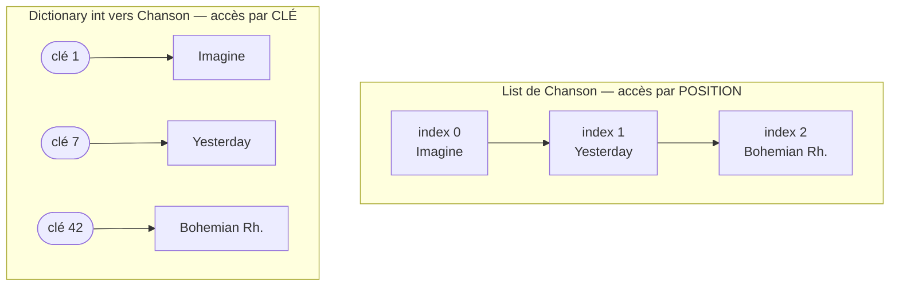

# 📚 Concept — Les collections : `List` et `Dictionary`

> **TP concerné :** TP1 · **Temps de lecture :** 7 min
> ▶️ **[Faire le TP1](../PlaylistApp/TP1_GUIDE.md)**

---

## L'idée

Une **collection** stocke plusieurs valeurs dans une seule variable. Les deux plus courantes en C# sont `List<T>` et `Dictionary<K,V>`.

## Deux façons d'organiser les données



## `List<T>` — une liste ordonnée

```csharp
List<Chanson> chansons = new();
chansons.Add(uneChanson);     // ajoute à la fin
chansons.Count;               // nombre d'éléments
chansons[0];                  // accès par position (index)
```
> 🧠 Une `List` **conserve l'ordre** d'insertion et **accepte les doublons**. Idéale pour une playlist (l'ordre compte). Pour retrouver un élément précis, il faut **parcourir** la liste.

## `Dictionary<K,V>` — un annuaire clé → valeur

```csharp
Dictionary<int, Chanson> parId = new();
parId[1] = chanson;           // la clé 1 pointe vers cette chanson
var c = parId[1];             // accès direct par la clé (très rapide)
parId.ContainsKey(5);         // la clé existe-t-elle ?
```
> 🧠 Un `Dictionary` associe une **clé unique** à une valeur. Retrouver une chanson par son `Id` est **instantané** (pas de parcours). En interne, la clé est transformée par une *fonction de hachage* qui pointe presque directement vers la bonne case.

## Lequel choisir ?

| Besoin | Collection | Coût d'une recherche |
|---|---|---|
| Garder un ordre, autoriser doublons | `List<T>` | parcours (lent si gros) |
| Retrouver vite par un identifiant unique | `Dictionary<K,V>` | quasi-instantané |

---

## 🏛️ Le point de vue de l'architecte

**Enjeu :** la structure de données retenue **conditionne la performance et la lisibilité** de l'accès aux données — un mauvais choix se paie en lenteur ou en bugs.

| Option | ✅ Forte | ⚠️ Faible |
|---|---|---|
| `List<T>` | conserve l'ordre, autorise les doublons | recherche par valeur lente (parcours O(n)) |
| `Dictionary<K,V>` | accès par clé quasi-instantané (O(1)) | pas d'ordre garanti, clé unique obligatoire |

**Le choix :** ordre/doublons → `List` ; recherche fréquente par identifiant → `Dictionary`. Très souvent : une `List` pour parcourir, un `Dictionary` pour retrouver vite.

## ✍️ Auto-évaluation

**Q1.** Quelle collection garde l'ordre d'insertion ?
<details><summary>▸ Voir la réponse</summary>

La `List<T>`. Le `Dictionary` n'offre **aucune garantie d'ordre**.
</details>

**Q2.** Pourquoi `Bibliotheque` utilise un `Dictionary<int, Chanson>` plutôt qu'une `List` ?
<details><summary>▸ Voir la réponse</summary>

Pour retrouver une chanson par son `Id` **directement** (`_chansons[id]`), sans parcourir toute la collection. C'est beaucoup plus rapide quand il y a beaucoup d'éléments.
</details>

**Q3.** Peut-on avoir deux fois la même clé dans un `Dictionary` ?
<details><summary>▸ Voir la réponse</summary>

Non. Les clés sont **uniques**. Tenter d'ajouter une clé existante lève une exception (ou écrase la valeur selon la méthode utilisée).
</details>


**Q4.** Comment accède-t-on au premier élément d'une `List` ?
<details><summary>▸ Voir la réponse</summary>

Par son **index** : `liste[0]` (les positions commencent à 0).
</details>

**Q5.** Que renvoie `dico.ContainsKey(5)` ?
<details><summary>▸ Voir la réponse</summary>

`true` ou `false` selon que la **clé** 5 existe déjà dans le `Dictionary`.
</details>

**Q6.** 🌳 Choix : pour compter le nombre de chansons par genre, quelle structure ?
<details><summary>▸ Voir la réponse</summary>

Un `Dictionary<string,int>` (genre → compteur) : on retrouve et incrémente chaque genre directement par sa clé.
</details>
---

✅ Cochez ce concept dans le [tableau de bord](https://ggaillard.github.io/playlist-csharp).
⬅️ [Retour aux concepts](README.md)
