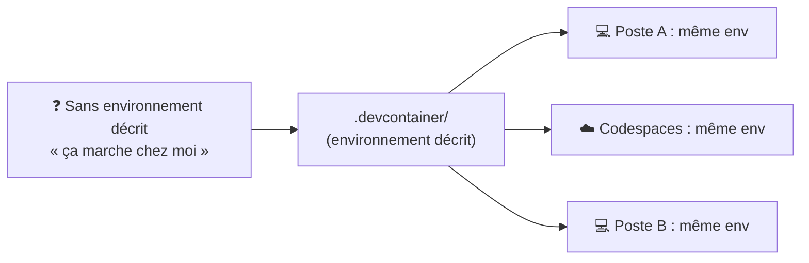
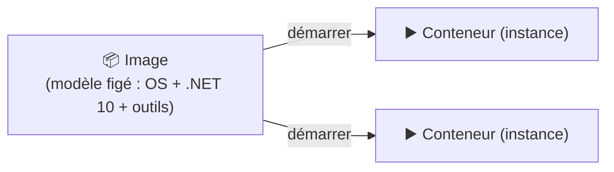

# 🐳 Concept — L'environnement de développement (Dev Container)

> **TP concerné :** TP0 · **Temps de lecture :** 8 min
> ▶️ **[Faire le TP0](../TP0_GUIDE.md)**

---

## L'idée

Un **environnement de développement**, c'est tout ce qu'il faut pour coder : le **SDK .NET**, les **outils** (Git, `dotnet-ef`, Docker), les **extensions** de l'éditeur. Le problème classique : *« ça marche chez moi »* — chacun a une configuration différente, et le projet ne se comporte pas pareil partout.

La solution : **décrire l'environnement dans le code** (un *Dev Container*) pour qu'il soit **identique pour tout le monde**.

> 🗺️ **Lire l'organigramme** : le même descriptif `.devcontainer` produit le **même environnement** partout — fini les différences entre machines.

## Conteneur : image vs instance (Docker)

Un **conteneur** est un environnement **isolé et léger**. Il part d'une **image** (un modèle figé : un OS minimal + .NET + les outils). On lance une ou plusieurs **instances** (conteneurs) à partir de cette image.

> 🗺️ **Légende** : l'**image** est le moule (comme une classe) ; le **conteneur** est une instance en exécution (comme un objet).

## Les deux fichiers du `.devcontainer`

| Fichier | Rôle |
|---|---|
| `devcontainer.json` | **Décrit** l'environnement : image .NET 10, fonctionnalités (Docker, Git), extensions VS Code, ports |
| `post-create.sh` | **Script lancé une fois** après création : installe `dotnet-ef`, restaure NuGet, prépare le dossier de données |

## Codespaces ou local ?

| | ☁️ GitHub Codespaces | 💻 VS Code local (Dev Containers) |
|---|---|---|
| Installation | **aucune** (tout dans le cloud) | Docker Desktop + VS Code + extension |
| Où ça tourne | serveur GitHub | votre machine |
| Idéal pour | démarrer vite, TP, postes non administrables | travailler hors-ligne, projets longs |

---

## 🏛️ Le point de vue de l'architecte

**Enjeu :** garantir un environnement **reproductible** — la base d'un projet en équipe (onboarding rapide, fin du « ça marche chez moi »).

| ✅ Avantages | ⚠️ Inconvénients / limites |
|---|---|
| Environnement **identique** pour tous, versionné dans le dépôt | Dépend de **Docker** (à installer en local) |
| Nouvel arrivant productif en quelques minutes | Première construction de l'image **plus lente** |
| Isolation : n'encombre pas la machine | Consomme des ressources (CPU/RAM) |

**Le choix :** un **Dev Container** dès qu'un projet est **partagé ou doit durer** ; une installation locale directe peut suffire pour un usage personnel léger.

---

## ✍️ Auto-évaluation

**Q1.** Quel problème un environnement de développement *décrit* (Dev Container) résout-il ?

▸ Voir la réponse

Le *« ça marche chez moi »* : il garantit un environnement **identique et reproductible** pour tout le monde, quel que soit le poste.

**Q2.** Quelle est la différence entre une **image** et un **conteneur** ?

▸ Voir la réponse

L'**image** est un **modèle figé** (OS + outils). Le **conteneur** est une **instance en exécution** créée à partir de l'image (comme objet ↔ classe).

**Q3.** À quoi sert `.devcontainer/devcontainer.json` ?

▸ Voir la réponse

À **décrire** l'environnement : image .NET 10, fonctionnalités (Docker, Git), extensions VS Code, ports transférés.

**Q4.** À quoi sert `post-create.sh` ?

▸ Voir la réponse

C'est un **script lancé une seule fois** après la création du conteneur : il installe `dotnet-ef`, restaure les paquets NuGet et prépare le dossier de données.

**Q5.** 🌳 Choix : un étudiant veut coder **tout de suite, sans rien installer**. Codespaces ou installation locale ?

▸ Voir la réponse

**Codespaces** : tout est dans le cloud, zéro installation. (L'installation locale est utile pour travailler hors-ligne ou sur des projets longs.)

**Q6.** Pourquoi un environnement reproductible est-il un atout **en équipe** ?

▸ Voir la réponse

Tout le monde a **exactement la même configuration** → beaucoup moins de bugs d'environnement, et un nouvel arrivant est productif **en quelques minutes**.

---

✅ Cochez ce concept dans le [tableau de bord](https://ggaillard.github.io/playlist-csharp).
⬅️ [Retour aux concepts](README.md)
