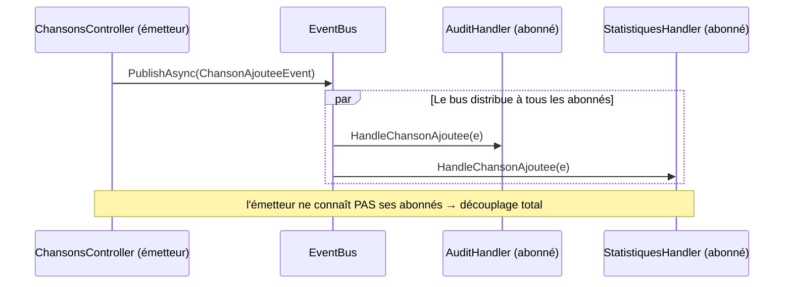
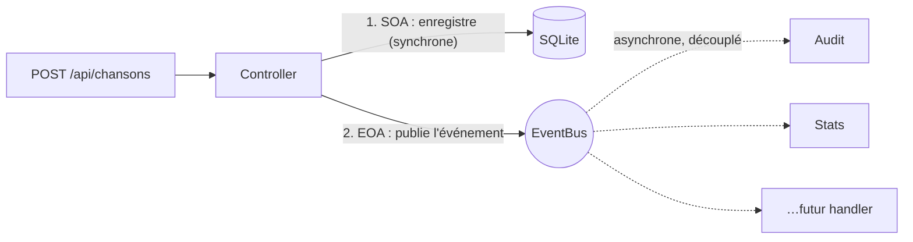
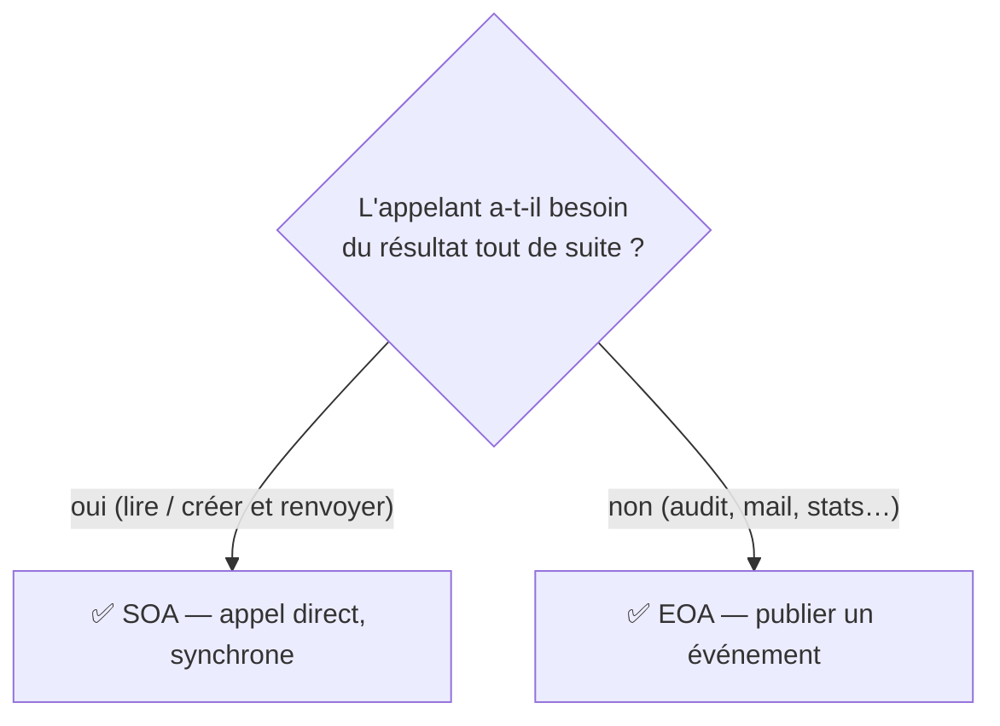

# 🎏 Concept — Événements et publish/subscribe (EOA)

> **TP concerné :** TP4 · **Temps de lecture :** 10 min
> ▶️ **[Faire le TP4](../PlaylistAppAPI/TP4_GUIDE.md)**

---

## Le problème

Quand on crée une chanson, on veut peut-être journaliser, mettre à jour des stats, notifier… Tout mettre dans le Controller le rend énorme et fragile : c'est le **couplage fort**.

## L'idée : annoncer au lieu d'ordonner

L'**EOA** (*Event-Oriented Architecture*) renverse la logique : au lieu d'ordonner chaque action, on **publie un événement** (« chanson ajoutée »), et **ceux que ça intéresse réagissent**.

> 📣 **Analogie de la gare :** le haut-parleur annonce un train. Il ne sait pas qui écoute. Les voyageurs concernés réagissent ; les autres ignorent.

## Les 3 rôles (publish/subscribe)

| Rôle | Qui | Fait |
|---|---|---|
| Émetteur | Controller | publie l'événement |
| Bus | `EventBus` | distribue aux abonnés |
| Abonnés | `AuditHandler`, `StatistiquesHandler` | réagissent |

Pour ajouter un comportement (ex. un e-mail), on crée un handler et on l'abonne — **sans toucher** au Controller.

## SOA et EOA se complètent

| | SOA | EOA |
|---|---|---|
| Logique | « fais et réponds » | « ceci est arrivé, réagissez » |
| Couplage | direct | découplé |
| Moment | synchrone | asynchrone |

> ⚙️ **Passage à l'échelle :** ici le bus est *en mémoire*. En production, on remplace `InMemoryEventBus` par un vrai courtier de messages (**Kafka**, **RabbitMQ**) sans changer la logique des émetteurs ni des abonnés — c'est le même contrat publish/subscribe.

---

## 🆚 SOA vs EOA : choisir selon l'usage

| Besoin | Architecture |
|---|---|
| Lire/écrire une donnée et renvoyer la réponse | **SOA** |
| Déclencher des effets de bord (audit, notif, cache) | **EOA** |
| Ajouter un comportement sans toucher l'émetteur | **EOA** |

> ⚠️ Ne pas sur-utiliser l'EOA : pour un effet **unique et immédiat**, l'appel direct (SOA) est plus simple à lire et à déboguer.

**Mini-test —** À la création d'une chanson, journaliser ET mettre à jour des stats sans alourdir le Controller : SOA ou EOA ?

▸ Voir la réponse

**EOA** : on publie un événement « chanson ajoutée » ; audit et stats sont des **abonnés** qui réagissent, sans que le Controller les connaisse.

## 🏛️ Le point de vue de l'architecte

**Enjeu :** **découpler** l'émetteur des réactions pour **étendre sans modifier**, et garder des temps de réponse stables.

| ✅ Avantages | ⚠️ Inconvénients / limites |
|---|---|
| Découplage fort : on ajoute des abonnés sans toucher l'émetteur | Le flux est moins lisible (« qui réagit à quoi ? ») |
| Réponses rapides (effets traités après-coup) | Débogage plus difficile |
| Passe à l'échelle (Kafka, RabbitMQ) | Livraison/ordre/erreurs des messages à gérer |

**Le choix :** EOA quand les effets sont **multiples, évolutifs ou découplés** ; un appel direct (SOA) reste préférable pour un effet **unique et immédiat**.

## ✍️ Auto-évaluation

**Q1.** Quel problème l'EOA résout-elle ?

▸ Voir la réponse

Le **couplage fort** : éviter que le code émetteur (le Controller) connaisse et appelle directement tous les effets de bord (audit, stats, notifications). On découple via des événements.

**Q2.** Citez les trois rôles du patron publish/subscribe.

▸ Voir la réponse

L'**émetteur** (publie), le **bus** (distribue), les **abonnés/handlers** (réagissent).

**Q3.** Pour ajouter une notification par e-mail, doit-on modifier le Controller ?

▸ Voir la réponse

Non. On crée un **nouveau handler** et on l'**abonne** à l'événement. Le Controller reste inchangé : c'est tout l'intérêt du découplage.

**Q4.** SOA et EOA sont-elles concurrentes ?

▸ Voir la réponse

Non, **complémentaires**. On enregistre la chanson en SOA (synchrone), puis on publie un événement en EOA pour les effets de bord (asynchrone, découplé).

**Q5.** En production, par quoi remplace-t-on le bus d'événements **en mémoire** ?

▸ Voir la réponse

Par un **courtier de messages** comme **Kafka** ou **RabbitMQ**, en gardant le même contrat *publish/subscribe* (émetteurs et abonnés ne changent pas).

**Q6.** 🌳 Choix : un endpoint avec **un seul** effet, immédiat et connu — faut-il l'EOA ?

▸ Voir la réponse

Non : un **appel direct (SOA)** est plus simple à lire et déboguer. L'EOA se justifie quand les réactions sont **multiples, évolutives ou à découpler**.

---

✅ Cochez ce concept dans le [tableau de bord](https://ggaillard.github.io/playlist-csharp).
⬅️ [Retour aux concepts](README.md)
