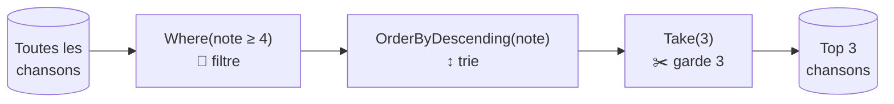
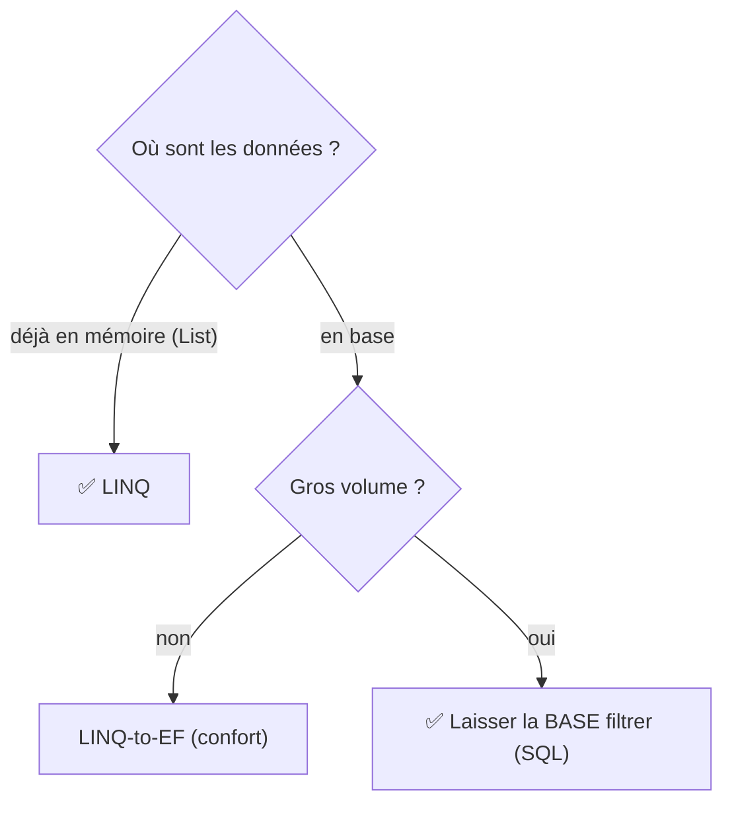

# 🔎 Concept — Les requêtes LINQ

> **TP concerné :** TP1 (et au-delà) · **Temps de lecture :** 8 min
> ▶️ **[Faire le TP1](../PlaylistApp/TP1_GUIDE.md)**

---

## L'idée

**LINQ** (*Language Integrated Query*) permet d'interroger une collection avec une syntaxe lisible : filtrer, trier, transformer, regrouper — sans écrire de boucles `for`.

## Une requête = une chaîne de traitements

Chaque opération prend une séquence en entrée et en produit une nouvelle en sortie. On les **enchaîne** comme un tapis roulant :



```csharp
chansons
    .Where(c => c.Note >= 4)        // filtrer
    .OrderByDescending(c => c.Note) // trier
    .Take(3);                       // garder les 3 premières
```

## Les opérations de base

```csharp
// Filtrer : garder les chansons de rock
chansons.Where(c => c.Genre == "Rock");

// Trier par artiste
chansons.OrderBy(c => c.Artiste);

// Transformer : ne garder que les titres
chansons.Select(c => c.Titre);

// Compter / premier / existence
chansons.Count(c => c.Annee > 2000);
chansons.FirstOrDefault(c => c.Id == 5);
chansons.Any(c => c.Note == 5);
```

> 🧠 `c => c.Genre == "Rock"` est une **expression lambda** : « pour chaque chanson `c`, garder celles dont le genre est Rock ». Le `=>` se lit « va vers » ou « tel que ».

> ⚙️ **À savoir :** LINQ est **paresseux** (*lazy*). La requête n'est exécutée qu'au moment où on **parcourt** le résultat (un `foreach`, un `.ToList()`, un `.Count()`). Tant qu'on l'enchaîne, rien n'est calculé. Au TP2, ce même LINQ sera **traduit en SQL** par EF Core.

---

## 🆚 SQL vs LINQ : comparatif, performance et choix

Même besoin — « les 3 chansons rock les mieux notées » — deux écritures :

| | SQL (langage de la base) | LINQ (intégré à C#) |
|---|---|---|
| Écriture | `SELECT Titre FROM Chansons WHERE Genre='Rock' ORDER BY Note DESC LIMIT 3;` | `chansons.Where(c => c.Genre=="Rock").OrderByDescending(c => c.Note).Take(3)` |
| S'exécute | dans le moteur de base | dans votre programme C# |
| Vérifié | à l'exécution (texte) | à la **compilation** (typé) |

### ⏱️ Mesurer le temps d'affichage

```csharp
var sw = System.Diagnostics.Stopwatch.StartNew();
var top = chansons.Where(c => c.Genre == "Rock")
                  .OrderByDescending(c => c.Note).Take(3).ToList();
sw.Stop();
Console.WriteLine($"⏱️ LINQ : {sw.Elapsed.TotalMilliseconds:F3} ms");
```

> 📏 **Ordre de grandeur** (à confirmer chez vous) : sur **petit volume déjà en mémoire**, LINQ est quasi instantané ; sur **gros volume stocké**, laisser la **base** filtrer/trier (SQL ou LINQ-to-EF) ne rapatrie que l'utile — bien plus rapide que tout charger en RAM.

### 🧭 Choisir selon l'usage



**Mini-test —** Table de 5 M de lignes, vous voulez le top 10 : pourquoi ne pas tout charger pour trier en LINQ ?
<details><summary>▸ Voir la réponse</summary>

On laisse la **base** trier via son **index** et ne renvoyer que 10 lignes. Charger 5 M de lignes en mémoire serait lent et coûteux ; LINQ-to-EF génère ce SQL pour vous.
</details>

## 🏛️ Le point de vue de l'architecte

**Enjeu :** gagner en **lisibilité** des requêtes sans perdre le **contrôle du coût** (mémoire, SQL généré).

| ✅ Avantages | ⚠️ Inconvénients / limites |
|---|---|
| Lisible, typé (vérifié à la compilation), composable | L'exécution paresseuse peut surprendre (requête rejouée) |
| Marche sur la mémoire **et** sur la base (LINQ-to-EF) | Mal écrit sur gros volume → tout chargé en RAM |
| Moins de boucles, code plus court | L'abstraction masque parfois le coût réel |

**Le choix :** LINQ par défaut pour la clarté ; sur de gros volumes en base, **surveiller le SQL généré** et la matérialisation (`ToList`).

## ✍️ Auto-évaluation

**Q1.** Que fait `chansons.Where(c => c.Annee >= 2000)` ?
<details><summary>▸ Voir la réponse</summary>

Renvoie toutes les chansons **dont l'année est supérieure ou égale à 2000** (un filtre). Les autres sont écartées.
</details>

**Q2.** Quelle est la différence entre `Where` et `Select` ?
<details><summary>▸ Voir la réponse</summary>

`Where` **filtre** (garde certains éléments) ; `Select` **transforme** (projette chaque élément vers autre chose, par exemple juste le titre). On les combine souvent.
</details>

**Q3.** Comment obtenir les 3 chansons les mieux notées ?
<details><summary>▸ Voir la réponse</summary>

```csharp
chansons.OrderByDescending(c => c.Note).Take(3);
```
On trie par note décroissante, puis on prend les 3 premières.
</details>


**Q4.** Que signifie « LINQ est paresseux (*lazy*) » ?
<details><summary>▸ Voir la réponse</summary>

La requête n'est **exécutée qu'au moment du parcours** (`foreach`, `.ToList()`, `.Count()`). Tant qu'on l'enchaîne, rien n'est calculé.
</details>

**Q5.** Que fait `.Select(c => c.Titre)` ?
<details><summary>▸ Voir la réponse</summary>

Il **projette/transforme** chaque chanson en son titre : on obtient une séquence de titres (pas de filtrage).
</details>

**Q6.** 🌳 Choix : au TP2, comment la même requête LINQ s'exécute-t-elle sur la base ?
<details><summary>▸ Voir la réponse</summary>

EF Core **traduit le LINQ en SQL** (LINQ-to-EF) : c'est la base qui filtre/trie, on ne rapatrie que le résultat utile.
</details>
---

✅ Cochez ce concept dans le [tableau de bord](https://ggaillard.github.io/playlist-csharp).
⬅️ [Retour aux concepts](README.md)
