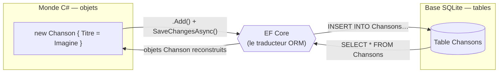
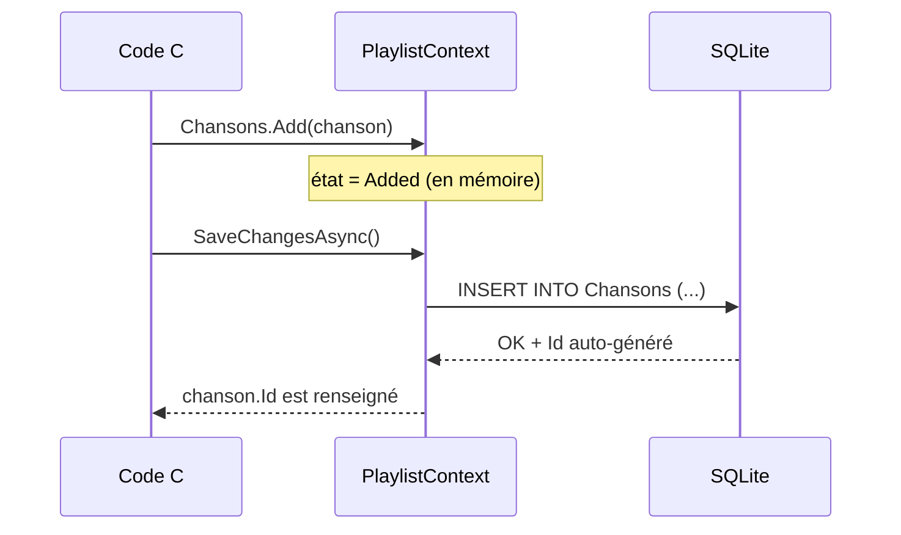

# 🗄️ Concept — L'ORM et le `DbContext`

> **TP concerné :** TP2 · **Temps de lecture :** 9 min
> ▶️ **[Faire le TP2](../PlaylistAppEF/TP2_GUIDE.md)**

---

## L'idée

Un **ORM** (*Object-Relational Mapping*) fait automatiquement le pont entre vos **classes C#** et les **tables d'une base de données**. Vous écrivez du C#, l'ORM génère le SQL.

> 🌉 **Analogie :** l'ORM est un **traducteur** entre deux langues : celle des objets (C#) et celle des tables (SQL). Vous parlez objets, il parle SQL à la base.



## Sans ORM vs avec ORM

```csharp
// Sans ORM : on écrit le SQL à la main (fastidieux, source d'erreurs)
"INSERT INTO Chansons (Titre, Artiste) VALUES ('Imagine', 'Lennon')";

// Avec ORM (EF Core) : on manipule des objets
_ctx.Chansons.Add(new Chanson { Titre = "Imagine", Artiste = "Lennon" });
await _ctx.SaveChangesAsync();
```

## Le `DbContext` : la porte d'entrée

Le `PlaylistContext` est la classe centrale d'EF Core. Chaque `DbSet` représente **une table** :
```csharp
public DbSet<Chanson> Chansons { get; set; }   // ↔ table "Chansons"
public DbSet<Playlist> Playlists { get; set; } // ↔ table "Playlists"
```
On interroge ensuite ces `DbSet` avec LINQ ; EF Core traduit en SQL.

## Le suivi des changements (*change tracking*)

Le `DbContext` ne sauvegarde rien tant qu'on n'appelle pas `SaveChangesAsync()`. Entre-temps, il **surveille** les objets et calcule le SQL minimal à exécuter :



---

## 🏛️ Le point de vue de l'architecte

**Enjeu :** arbitrer entre **productivité** (manipuler des objets) et **contrôle/performance** (maîtriser le SQL).

| ✅ Avantages | ⚠️ Inconvénients / limites |
|---|---|
| Productivité : on pense objets, pas SQL | « Magie » qui masque le SQL (risque de requêtes N+1) |
| Portabilité entre bases, moins d'erreurs de syntaxe | Performance parfois en retrait sur requêtes complexes |
| Suivi des changements, migrations intégrées | Fuites d'abstraction : il faut quand même comprendre le SQL |

**Le choix :** l'ORM pour le **CRUD courant** ; pour les requêtes critiques en perf, descendre au **SQL** (vues, requêtes brutes, micro-ORM).

## ✍️ Auto-évaluation

**Q1.** Que signifie ORM et à quoi ça sert ?
<details><summary>▸ Voir la réponse</summary>

*Object-Relational Mapping*. Il relie automatiquement les **classes C#** aux **tables SQL**, évitant d'écrire le SQL à la main.
</details>

**Q2.** À quoi correspond un `DbSet<Chanson>` ?
<details><summary>▸ Voir la réponse</summary>

À **une table** dans la base de données (ici la table des chansons). On y ajoute, lit, supprime des objets `Chanson`.
</details>

**Q3.** Quelle méthode enregistre réellement les changements en base ?
<details><summary>▸ Voir la réponse</summary>

`SaveChangesAsync()` (ou `SaveChanges()`). Tant qu'on ne l'appelle pas, les modifications restent en mémoire (suivies par le *change tracker*).
</details>


**Q4.** Que se passe-t-il si on fait `.Add(chanson)` **sans** `SaveChangesAsync()` ?
<details><summary>▸ Voir la réponse</summary>

La chanson est marquée « Added » **en mémoire** (suivie par le *change tracker*), mais **rien n'est écrit en base** tant qu'on ne sauvegarde pas.
</details>

**Q5.** Citez un inconvénient d'un ORM.
<details><summary>▸ Voir la réponse</summary>

Il **masque le SQL généré** : on peut produire des requêtes inefficaces (ex. N+1) sans s'en rendre compte. Pour des requêtes critiques, on peut préférer du SQL explicite.
</details>

**Q6.** À quoi sert le paquet `Microsoft.EntityFrameworkCore.Sqlite` ?
<details><summary>▸ Voir la réponse</summary>

C'est le **fournisseur (provider)** qui permet à EF Core de dialoguer avec une base **SQLite** (traduire les requêtes dans son dialecte).
</details>
---

✅ Cochez ce concept dans le [tableau de bord](https://ggaillard.github.io/playlist-csharp).
⬅️ [Retour aux concepts](README.md)
