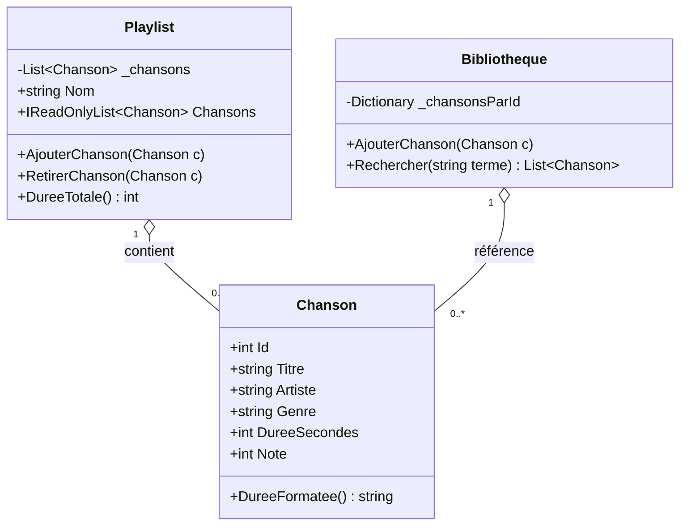
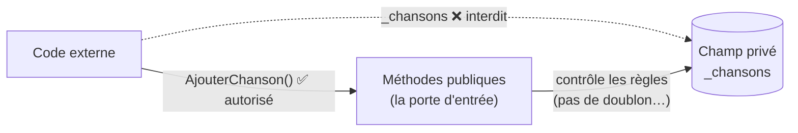

# 🧱 Concept — La Programmation Orientée Objet (POO)

> **TP concerné :** TP1 · **Temps de lecture :** 10 min
> ▶️ **[Faire le TP1](../PlaylistApp/TP1_GUIDE.md)**

---

## L'idée en une phrase

La POO consiste à **organiser le code en objets** : des « boîtes » qui regroupent des **données** (propriétés) et des **comportements** (méthodes) qui vont ensemble.

## Pourquoi ?

Sans POO, on a des variables éparpillées et des fonctions qui se baladent. Avec la POO, on **regroupe** ce qui concerne une même chose. Une chanson a un titre, un artiste, une durée, et sait s'afficher : tout cela vit dans **une seule classe** `Chanson`.

> 🎁 **Analogie :** une classe est un **moule** ; un objet est un **gâteau** fait avec ce moule. Le moule `Chanson` permet de fabriquer autant de chansons que l'on veut, toutes avec la même structure.

## Le modèle objet du TP1 (vue d'ensemble)



**Comment lire ce diagramme :** chaque rectangle est une **classe**. Le `+` marque ce qui est **public** (accessible de l'extérieur), le `-` ce qui est **privé** (caché). Le losange `o--` signifie « **contient / est composé de** » : une `Playlist` regroupe plusieurs `Chanson`.

## Les 3 notions à retenir

### Classe et objet
```csharp
public class Chanson         // la classe (le moule)
{
    public string Titre { get; set; }
}
var c = new Chanson();       // un objet (une instance)
c.Titre = "Imagine";
```

### Encapsulation
On **protège** les données internes. Dans `Playlist`, la liste est **privée** (`_chansons`) ; on n'y accède de l'extérieur qu'en **lecture seule** :
```csharp
private List<Chanson> _chansons = new();
public IReadOnlyList<Chanson> Chansons => _chansons.AsReadOnly();
```



> 🧠 Personne ne peut ajouter une chanson « par la bande » : on **doit** passer par `AjouterChanson(...)`, qui peut vérifier les règles. C'est l'encapsulation : la donnée est protégée derrière une porte unique.

### Propriété vs méthode
- **Propriété** = une donnée (`Titre`, `Artiste`).
- **Méthode** = une action (`DureeFormatee()`, `AjouterChanson(...)`).

---

## 🏛️ Le point de vue de l'architecte

**Enjeu :** décider comment **structurer** le code pour qu'il reste compréhensible et modifiable quand l'application grandit — et **quoi exposer ou cacher** (encapsulation).

| ✅ Avantages | ⚠️ Inconvénients / limites |
|---|---|
| Données + comportements regroupés : code lisible et réutilisable | Sur-conception possible (trop de classes/abstractions) |
| L'encapsulation protège les règles métier (invariants) | Plus verbeux qu'un simple script procédural |
| Base saine pour faire évoluer l'app | Courbe d'apprentissage (héritage, polymorphisme…) |

**Le choix :** la POO s'impose dès qu'il y a des **règles métier** et une durée de vie. Pour un mini-script jetable, le procédural suffit — ne pas « tout objet-ifier » par réflexe.

## ✍️ Auto-évaluation

> Essayez de répondre **avant** de déplier.

**Q1.** Quelle est la différence entre une classe et un objet ?

<details><summary>▸ Voir la réponse</summary>

Une **classe** est un modèle (le moule) qui décrit une structure. Un **objet** est une instance concrète créée à partir de cette classe (le gâteau). On peut créer plusieurs objets à partir d'une même classe.
</details>

**Q2.** Pourquoi rend-on le champ `_chansons` privé dans `Playlist` ?

<details><summary>▸ Voir la réponse</summary>

Pour l'**encapsulation** : empêcher toute modification non contrôlée de la liste depuis l'extérieur. On force le passage par `AjouterChanson(...)` / `RetirerChanson(...)`, qui peuvent appliquer des règles (éviter les doublons, par exemple).
</details>

**Q3.** `DureeFormatee()` est-elle une propriété ou une méthode ? Pourquoi ?

<details><summary>▸ Voir la réponse</summary>

C'est une **méthode** : elle **fait un calcul** (convertir des secondes en `mm:ss`) et se note avec des parenthèses `()`. Une propriété, elle, expose simplement une donnée.
</details>

**Q4.** Dans `public IReadOnlyList<Chanson> Chansons`, que signifie `IReadOnlyList` ?

<details><summary>▸ Voir la réponse</summary>

Cela expose la liste en **lecture seule** : on peut la parcourir et la lire de l'extérieur, mais pas y ajouter ni retirer d'éléments directement. C'est une protection (encapsulation).
</details>


**Q5.** À quoi sert un **constructeur** comme `new Chanson(...)` ?
<details><summary>▸ Voir la réponse</summary>

À **initialiser** un nouvel objet au moment de sa création (renseigner ses propriétés de départ). C'est le point d'entrée pour fabriquer une instance à partir de la classe.
</details>

**Q6.** Donnez un avantage concret de regrouper données et méthodes dans une même classe.
<details><summary>▸ Voir la réponse</summary>

Le code est plus **lisible et maintenable** : tout ce qui concerne une chanson (ses données *et* ses comportements) vit au même endroit, réutilisable, sans variables éparpillées.
</details>
---

✅ **Concept acquis ?** Cochez-le dans le [tableau de bord](https://ggaillard.github.io/playlist-csharp) (onglet Quiz).
⬅️ [Retour aux concepts](README.md)
