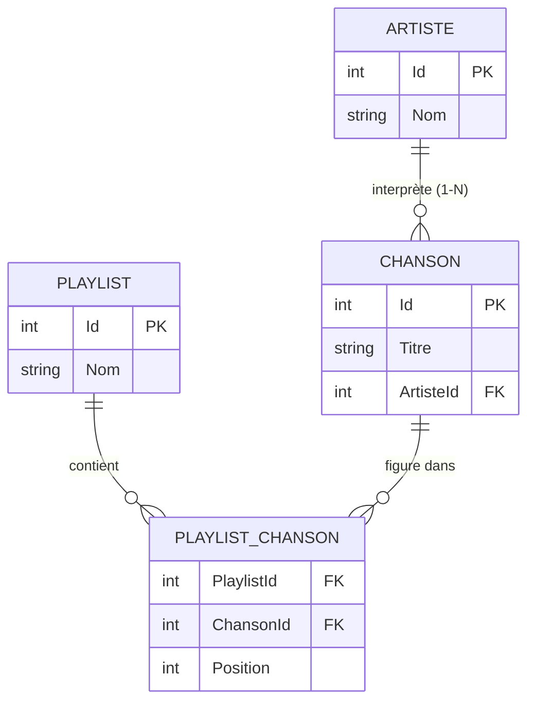
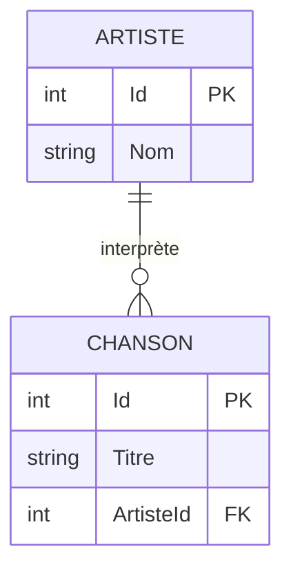
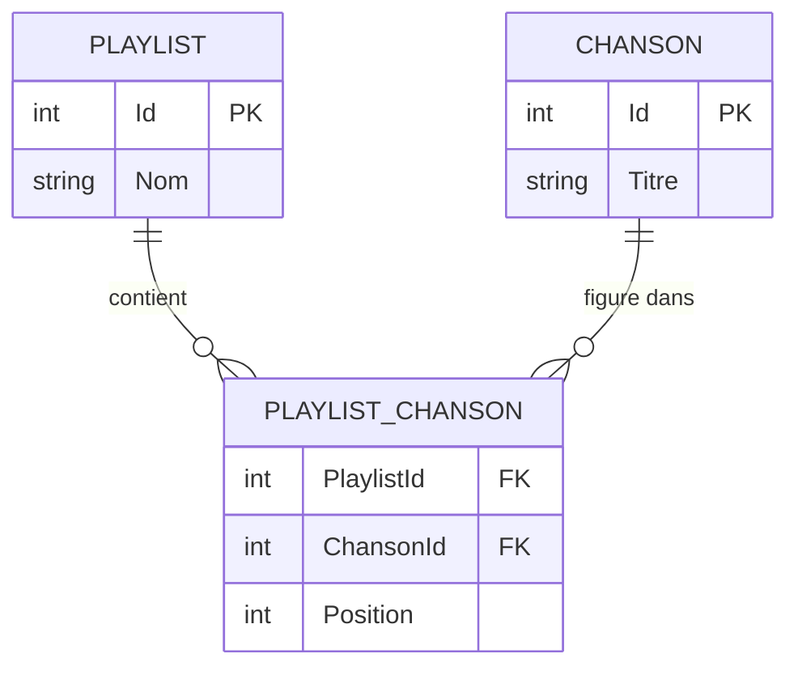

# 🔗 Concept — Les relations entre entités (1-N, N-N)

> **TP concerné :** TP2 · **Temps de lecture :** 12 min
> ▶️ **[Faire le TP2](../PlaylistAppEF/TP2_GUIDE.md)**

---

## L'idée

Les données du monde réel sont **liées** : un artiste a plusieurs chansons, une playlist contient plusieurs chansons. On modélise ces liens par des **relations**.

## Le modèle de données du projet



Les symboles `||` (un) et `o{` (plusieurs) se lisent : un `ARTISTE` est lié à **plusieurs** `CHANSON`.

## Relation un-à-plusieurs (1-N)

**Définition :** une ligne du côté « **1** » est liée à **plusieurs** lignes du côté « **N** », mais chaque ligne du côté « N » n'est liée qu'à **une seule** ligne du côté « 1 ».

> Exemple : **un artiste** interprète **plusieurs chansons** ; mais **une chanson** n'a qu'**un seul** artiste.



**Lire la cardinalité :** `||` = « exactement un », `o{` = « zéro ou plusieurs ». Donc **un** ARTISTE ↔ **plusieurs** CHANSON.

**En base de données :** la **clé étrangère se place toujours du côté « plusieurs »**. La table `Chansons` porte une colonne `ArtisteId` qui pointe vers `Artistes.Id` :

*Table Artistes*

| Id | Nom |
|---|---|
| 1 | Queen |
| 2 | Lennon |

*Table Chansons*

| Id | Titre | ArtisteId |
|---|---|---|
| 10 | Bohemian Rhapsody | **1** |
| 11 | We Will Rock You | **1** |
| 12 | Imagine | **2** |

> Les chansons 10 et 11 pointent toutes deux vers l'artiste 1 → « **plusieurs chansons pour un artiste** ».

**En C# (EF Core)** — on déclare des **propriétés de navigation** :

```csharp
public class Artiste
{
    public int Id { get; set; }
    public string Nom { get; set; } = "";
    // côté « N » : une COLLECTION de chansons
    public ICollection<Chanson> Chansons { get; set; } = new List<Chanson>();
}

public class Chanson
{
    public int Id { get; set; }
    public string Titre { get; set; } = "";
    public int ArtisteId { get; set; }     // la clé étrangère
    public Artiste? Artiste { get; set; }  // côté « 1 » : une référence simple
}
```

> 🧠 Côté « 1 » → une **collection** (`ICollection<Chanson>`). Côté « N » → une **référence** (`Artiste`) **+ la clé étrangère** (`ArtisteId`).

## Relation plusieurs-à-plusieurs (N-N)

**Définition :** chaque ligne d'un côté peut être liée à **plusieurs** lignes de l'autre, **dans les deux sens**.

> Exemple : **une playlist** contient **plusieurs chansons**, **et** **une chanson** peut figurer dans **plusieurs playlists**.

**Pourquoi on ne peut pas la stocker directement :** une ligne possède des colonnes **fixes** ; elle ne peut pas contenir une **liste de longueur variable** de clés étrangères. On introduit donc une **table de liaison** (ou *table de jonction*) qui enregistre **chaque association** sur une ligne.



> 🧠 La table de liaison **décompose le N-N en deux relations 1-N** (PLAYLIST 1-N PLAYLIST_CHANSON, et CHANSON 1-N PLAYLIST_CHANSON). C'est **la** solution standard du référentiel BTS (MLD).

**En base de données :** chaque couple (playlist, chanson) = **une ligne** de `PlaylistChanson` :

| PlaylistId | ChansonId | Position |
|---|---|---|
| 1 | 10 | 1 |
| 1 | 12 | 2 |
| 2 | 10 | 1 |

> La chanson 10 figure dans les playlists 1 **et** 2 → c'est bien du N-N. La table porte aussi `Position` : une **donnée propre à l'association**.

**En C# (EF Core)** — table de liaison **explicite** (parce qu'elle porte `Position`) :

```csharp
public class PlaylistChanson
{
    public int PlaylistId { get; set; }    // FK → Playlists.Id
    public int ChansonId  { get; set; }    // FK → Chansons.Id
    public int Position   { get; set; }    // donnée propre à l'association
    public Playlist? Playlist { get; set; }
    public Chanson?  Chanson  { get; set; }
}

// Dans Playlist ET dans Chanson, la navigation passe par la liaison :
public ICollection<PlaylistChanson> PlaylistChansons { get; set; } = new List<PlaylistChanson>();
```

> ⚙️ EF Core sait aussi gérer un N-N **implicite** (sans classe de liaison). Ici on garde une **classe explicite** car on veut stocker une **donnée sur l'association** (la `Position` de la chanson dans la playlist).
> Pour lister les chansons d'une playlist, on passe **par** la liaison : `playlist.PlaylistChansons.Select(pc => pc.Chanson)`.

---

## 🏛️ Le point de vue de l'architecte

**Enjeu :** modéliser fidèlement le métier tout en garantissant l'**intégrité** des données et des requêtes efficaces.

| ✅ Avantages | ⚠️ Inconvénients / limites |
|---|---|
| Intégrité référentielle (clés étrangères) | Modèle plus complexe à concevoir |
| Pas de duplication de données | Les jointures ont un coût |
| Requêtes riches (regrouper, filtrer, joindre) | Le chargement (`Include`) doit être maîtrisé |

**Le choix :** **normaliser** (relations) par défaut ; **dénormaliser** ponctuellement (copier une donnée) seulement pour accélérer des lectures critiques.

## ✍️ Auto-évaluation

**Q1.** Donnez un exemple de relation 1-N dans le projet.
<details><summary>▸ Voir la réponse</summary>

Un **artiste** possède plusieurs **chansons**, mais chaque chanson n'a qu'un artiste. (Ou : une playlist a plusieurs entrées d'ordre.)
</details>

**Q2.** Comment modélise-t-on une relation N-N ?
<details><summary>▸ Voir la réponse</summary>

Avec une **table de liaison** (ici `PlaylistChanson`) qui porte les deux clés étrangères (`PlaylistId` et `ChansonId`). Elle relie les deux tables en décomposant le N-N en deux 1-N.
</details>

**Q3.** Que contient en général la table de liaison en plus des deux clés ?
<details><summary>▸ Voir la réponse</summary>

Souvent des données propres à l'association, comme la **position** de la chanson dans la playlist, ou une date d'ajout.
</details>


**Q4.** Qu'est-ce qu'une **clé étrangère** ?
<details><summary>▸ Voir la réponse</summary>

Une colonne qui **référence la clé primaire d'une autre table** : elle matérialise le lien entre les deux tables.
</details>

**Q5.** Dans le projet, quelle table porte la clé étrangère `ArtisteId` ?
<details><summary>▸ Voir la réponse</summary>

La table **Chansons** (le côté « plusieurs » de la relation 1-N : plusieurs chansons pour un artiste).
</details>

**Q6.** Pourquoi ne peut-on pas relier directement deux tables en N-N ?
<details><summary>▸ Voir la réponse</summary>

Une ligne ne peut pas pointer vers plusieurs lignes à la fois. On passe par une **table de liaison** qui décompose le N-N en **deux relations 1-N**.
</details>
---

✅ Cochez ce concept dans le [tableau de bord](https://ggaillard.github.io/playlist-csharp).
⬅️ [Retour aux concepts](README.md)
