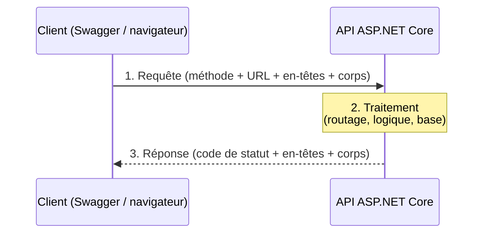
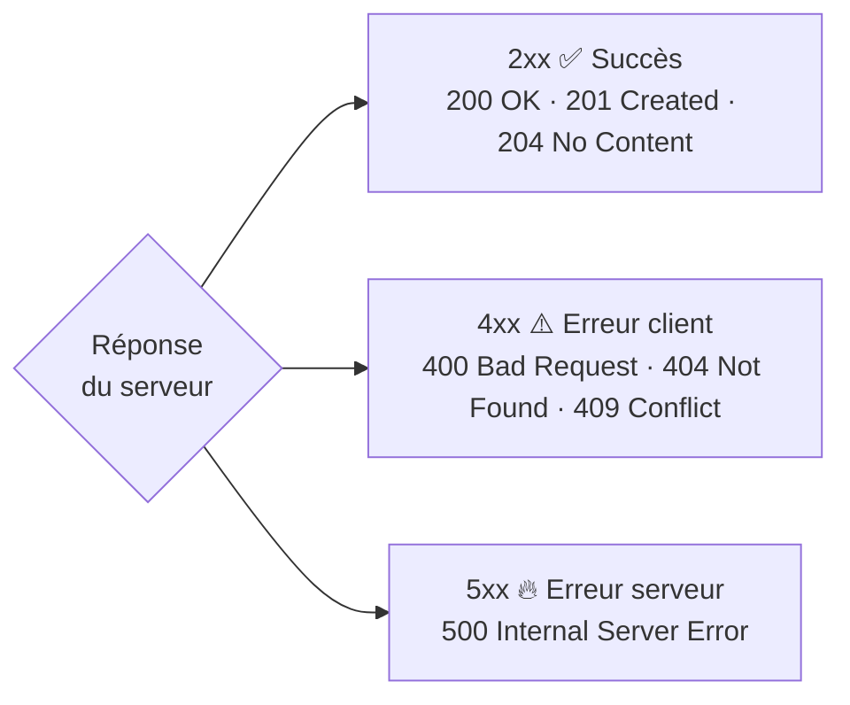

# 🌐 Concept — HTTP, REST et codes de statut

> **TP concerné :** TP3 · **Temps de lecture :** 11 min
> ▶️ **[Faire le TP3](../PlaylistAppAPI/TP3_GUIDE.md)**

---

## HTTP : le protocole du web

HTTP (*HyperText Transfer Protocol*) est un protocole **requête / réponse** : le client demande, le serveur répond. Il est **sans état** (*stateless*) — chaque requête est indépendante, le serveur ne « se souvient » pas de la précédente.



### Anatomie d'une requête et d'une réponse

```http
POST /api/chansons HTTP/1.1
Host: localhost:5000
Content-Type: application/json

{ "titre": "Imagine", "artiste": "Lennon", "dureeSecondes": 183 }
```
```http
HTTP/1.1 201 Created
Location: /api/chansons/12
Content-Type: application/json

{ "id": 12, "titre": "Imagine", "artiste": "Lennon" }
```

> 🧩 Une requête = **méthode** (POST) + **chemin** (/api/chansons) + **en-têtes** (`Content-Type`…) + **corps** (les données JSON). Une réponse = **code de statut** (201) + **en-têtes** (`Location`…) + **corps**.

## REST : des ressources et des verbes

REST organise l'API autour de **ressources** (ici « chanson ») identifiées par une **URL**, manipulées par les **verbes HTTP** :

| Action | Verbe | URL | Succès | Idempotent ? |
|---|---|---|---|---|
| Lister | `GET` | `/api/chansons` | 200 | ✅ |
| Voir n°5 | `GET` | `/api/chansons/5` | 200 | ✅ |
| Créer | `POST` | `/api/chansons` | 201 | ❌ |
| Remplacer | `PUT` | `/api/chansons/5` | 204 | ✅ |
| Supprimer | `DELETE` | `/api/chansons/5` | 204 | ✅ |

> 🧠 L'URL dit **quoi** (la ressource), le verbe dit **quelle action**. **Idempotent** = répéter la requête donne le même résultat (un `DELETE` deux fois → toujours supprimé ; un `POST` deux fois → deux créations).

## Les codes de statut



> 🧠 **2xx** « c'est bon », **4xx** « tu t'es trompé » (mauvaise donnée, ressource absente), **5xx** « je me suis trompé » (bug serveur).

## JSON : le format d'échange

Les données circulent en **JSON** (`Content-Type: application/json`). ASP.NET Core **sérialise** automatiquement les objets C# en JSON pour la réponse, et **désérialise** le JSON reçu en objets pour la requête. C'est la *négociation de contenu*.

---

## 🏛️ Le point de vue de l'architecte

**Enjeu :** exposer un service **interopérable** et **sans état**, compréhensible par n'importe quel client.

| ✅ Avantages | ⚠️ Inconvénients / limites |
|---|---|
| Standard universel, outillé (Swagger), cacheable | Verbeux ; sur-/sous-récupération de données |
| Sans état → facile à mettre à l'échelle | Peu adapté au temps réel / aux flux |
| Découplé du langage client | Plusieurs allers-retours pour des données liées |

**Le choix :** REST pour des **API de ressources (CRUD)** ; sinon **gRPC** (perf interne), **GraphQL** (requêtes flexibles) ou **WebSocket** (temps réel) selon le besoin.

## ✍️ Auto-évaluation

**Q1.** Quel verbe pour créer une ressource, et quel code en cas de succès ?
<details><summary>▸ Voir la réponse</summary>

`POST`, et le code **201 Created** (souvent accompagné d'un en-tête `Location` vers la nouvelle ressource).
</details>

**Q2.** Que signifie un code 404 ?
<details><summary>▸ Voir la réponse</summary>

**Not Found** : la ressource demandée n'existe pas. C'est une erreur **4xx** (côté client : il a demandé quelque chose d'inexistant).
</details>

**Q3.** Que veut dire « HTTP est sans état (stateless) » ?
<details><summary>▸ Voir la réponse</summary>

Chaque requête est **indépendante** : le serveur ne conserve pas le contexte d'une requête à l'autre. Toute information nécessaire doit être renvoyée à chaque fois (dans l'URL, les en-têtes ou le corps).
</details>

**Q4.** Pourquoi dit-on que `GET` et `DELETE` sont idempotents mais pas `POST` ?
<details><summary>▸ Voir la réponse</summary>

Répéter un `GET` ou un `DELETE` aboutit au **même état final**. Répéter un `POST` **crée plusieurs ressources** : il n'est donc pas idempotent.
</details>


**Q5.** Quel en-tête / format utilise-t-on pour échanger des données structurées ?
<details><summary>▸ Voir la réponse</summary>

Le **JSON** (`Content-Type: application/json`). ASP.NET Core sérialise les objets C# en JSON et désérialise le JSON reçu.
</details>

**Q6.** 🌳 Choix : besoin de notifications **temps réel** poussées par le serveur — REST suffit-il ?
<details><summary>▸ Voir la réponse</summary>

Non : REST est en **requête/réponse** (le client demande). Pour du temps réel poussé, on utilise **WebSocket** (ou SSE).
</details>
---

✅ Cochez ce concept dans le [tableau de bord](https://ggaillard.github.io/playlist-csharp).
⬅️ [Retour aux concepts](README.md)
